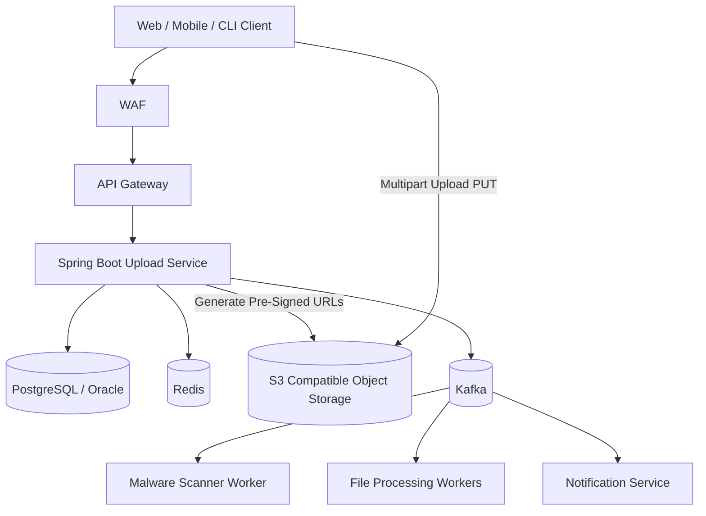
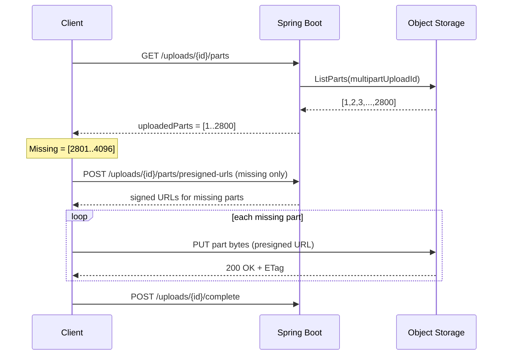
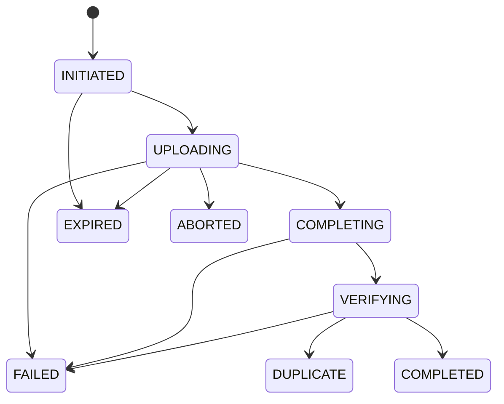
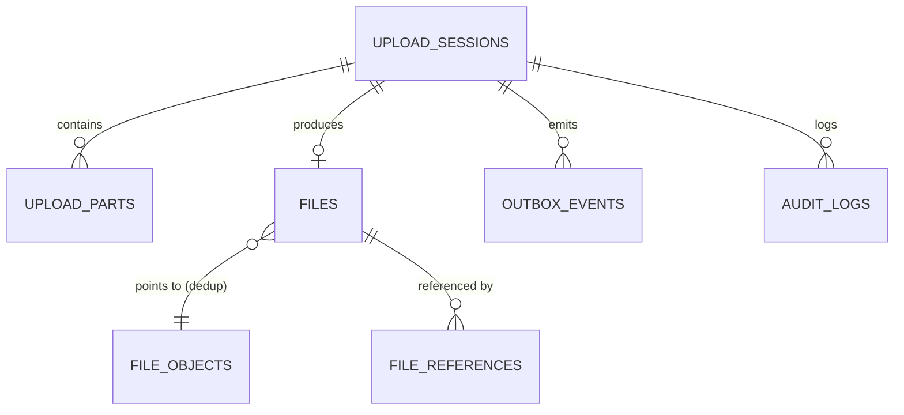
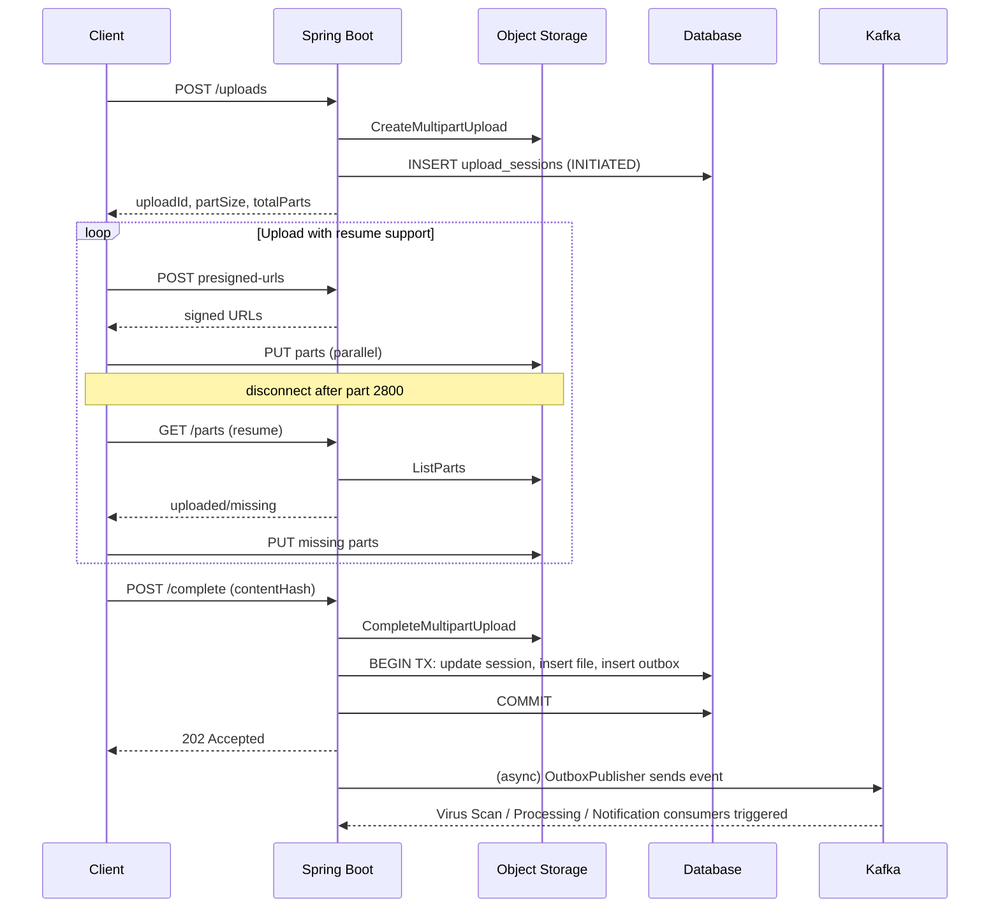

# Production-Grade 1 TB+ File Upload System
### Java 21 + Spring Boot 4 — System Design & Implementation Guide

> **ভাষা নোট (Language note):** এই ডকুমেন্টে ব্যাখ্যা বাংলায় করা হয়েছে, টেকনিক্যাল টার্ম এবং কোড ইংরেজিতে রাখা হয়েছে — যাতে একজন Senior/Principal Engineer সহজে follow করতে পারেন এবং implementation-ready থাকে।

---

## Table of Contents

1. [Problem Statement](#1-problem-statement)
2. [Goals](#2-goals)
3. [Non-Goals](#3-non-goals)
4. [High-Level Architecture](#4-high-level-architecture)
5. [Control Plane vs Data Plane](#5-control-plane-vs-data-plane)
6. [Why Normal REST Upload Does Not Work](#6-why-normal-rest-upload-does-not-work)
7. [Multipart Upload](#7-multipart-upload)
8. [Resumable Upload](#8-resumable-upload)
9. [Upload Session](#9-upload-session)
10. [Pre-Signed URLs](#10-pre-signed-urls)
11. [Upload State Machine](#11-upload-state-machine)
12. [API Design](#12-api-design)
13. [Database Design](#13-database-design)
14. [Duplicate File Detection](#14-duplicate-file-detection)
15. [SHA-256 Strategy](#15-sha-256-strategy)
16. [ETag Warning](#16-etag-warning)
17. [Kafka Event Architecture](#17-kafka-event-architecture)
18. [Transactional Outbox](#18-transactional-outbox)
19. [Redis Usage](#19-redis-usage)
20. [Idempotency](#20-idempotency)
21. [Concurrency](#21-concurrency)
22. [Failure Scenarios](#22-failure-scenarios)
23. [Security](#23-security)
24. [Virus/Malware Scanning](#24-virusmalware-scanning)
25. [File Lifecycle & Cleanup](#25-file-lifecycle--cleanup)
26. [Observability](#26-observability)
27. [Kubernetes / OpenShift](#27-kubernetes--openshift)
28. [Performance Design](#28-performance-design)
29. [Spring Boot Project Structure](#29-spring-boot-project-structure)
30. [Step-by-Step Java Implementation](#30-step-by-step-java-implementation)
31. [End-to-End Example Flow](#31-end-to-end-example-flow)
32. [docker-compose for Local Dev](#32-docker-compose-for-local-dev)
33. [Tests (Unit / Integration / Load)](#33-tests-unit--integration--load)
34. [Production Checklist](#34-production-checklist)
35. [Architecture Decisions (Why / Alternative / Trade-off)](#35-architecture-decisions)
36. [Important Design Constraints (Never Do This)](#36-important-design-constraints)
37. [Final Architecture Diagram](#37-final-architecture-diagram)

---

## 1. Problem Statement

**কী?** আমরা এমন একটা upload platform বানাতে চাই যেটা ব্যবহারকারীকে **1 GB থেকে 2 TB+** সাইজের ফাইল আপলোড করতে দেবে — reliably, resumably, এবং duplicate storage ছাড়া।

**কেন দরকার?** সাধারণ REST multipart-form-data upload (browser থেকে সরাসরি Spring Boot-এ বাইট পাঠানো) ছোট ফাইলে (কয়েক MB/GB) কাজ করলেও, 100 GB বা 1 TB ফাইলে সম্পূর্ণভাবে ভেঙে পড়ে — memory pressure, timeout, connection drop, ইত্যাদি কারণে।

**কীভাবে কাজ করবে?** File bytes কখনো Spring Boot-এর মধ্য দিয়ে যাবে না। Spring Boot শুধু **metadata, session, security, এবং orchestration** নিয়ন্ত্রণ করবে (Control Plane), আর client সরাসরি Object Storage-এ (S3/MinIO/Ceph) বাইট পাঠাবে (Data Plane)।

```text
                    CONTROL PLANE
Client → API Gateway / WAF → Spring Boot Upload Service
                                   |
                    +--------------+--------------+
                    |              |              |
                Database         Redis          Kafka

                    DATA PLANE
Client --(multipart chunks)--> S3 / MinIO / Ceph / Object Storage
```

**Core principle:** Spring Boot application টা কখনোই file-transfer bottleneck হতে পারবে না।

---

## 2. Goals

- 1 GB থেকে 2 TB+ ফাইল reliably আপলোড করা
- Network interruption হলে upload **resume** করা যাবে (0 থেকে আবার শুরু নয়)
- একই content দুইবার আপলোড হলে **deduplicate** করা (storage বাঁচানো)
- Horizontal scaling — একাধিক pod একসাথে কাজ করবে, কোনো sticky/local state ছাড়া
- Strong consistency মেটাডেটা লেভেলে (DB source of truth)
- Asynchronous virus scanning, processing, notification (Kafka-driven)
- Full observability (metrics, tracing, structured logs)
- Banking-grade security — tenant isolation, scoped signed URL, audit trail

## 3. Non-Goals

- এই ডকুমেন্ট কোনো নির্দিষ্ট cloud vendor lock-in প্রমোট করে না — S3-compatible API (AWS S3, MinIO, Ceph RGW) যেকোনোটাতেই কাজ করবে
- Client-side UI/UX design এই স্কোপে নেই
- End-to-end client-side encryption এই ডকুমেন্টের প্রাথমিক স্কোপে আলোচনা করা হয়নি (production checklist-এ future item হিসেবে উল্লেখ থাকবে)

---

## 4. High-Level Architecture



**Component ব্যাখ্যা:**

| Component | দায়িত্ব |
|---|---|
| **WAF** | Layer 7 attack filtering (SQLi, XSS, bot traffic) |
| **API Gateway** | Rate limiting, routing, TLS termination |
| **Upload Service (Spring Boot)** | Session তৈরি, presigned URL জেনারেট, স্টেট ম্যানেজমেন্ট, dedup check, idempotency, audit |
| **PostgreSQL/Oracle** | Source of truth — upload session, parts, files metadata |
| **Redis** | Rate limiting counters, short-lived cache, distributed lock (optional) — কখনোই source of truth না |
| **Object Storage (S3/MinIO)** | প্রকৃত ফাইল বাইট, multipart parts, durability |
| **Kafka** | Async event bus — upload completed event নিয়ে downstream workers trigger করে |
| **Scanner/Processor/Notification** | Kafka consumer — asynchronous post-processing |

---

## 5. Control Plane vs Data Plane

এটা এই পুরো ডিজাইনের **সবচেয়ে গুরুত্বপূর্ণ concept**।

### Control Plane (Spring Boot manages)
```text
Authentication / Authorization
Upload Session lifecycle
Metadata (file name, size, content-type)
Presigned URL generation
Upload state tracking
Checksum metadata
Deduplication logic
Audit trail
Kafka event publishing
```

### Data Plane (Object Storage handles)
```text
Actual file bytes
Multipart parts (256 MB chunk-এর মতো)
Large file storage & durability (11 nines-এর মতো)
Storage-level replication
```

**কেন এই separation critical, বিশেষ করে 1 TB ফাইলের জন্য?**

1 TB ফাইল JVM heap দিয়ে পাস করানো মানে — application-এর memory, network socket, thread pool সব কিছু single ফাইল ট্রান্সফারে ব্লক হয়ে যাওয়া। Object Storage (S3/MinIO/Ceph) বিশেষভাবে ডিজাইন করা হয়েছে বিশাল বাইট স্ট্রিম parallel/chunked ভাবে নেওয়ার জন্য, নিজস্ব storage nodes, network fabric নিয়ে — Spring Boot-এর application server সেটা করার জন্য বানানো না।

Control plane আর data plane আলাদা থাকলে:
- Upload service **stateless** থাকে → horizontal scaling সহজ
- একটা pod ক্র্যাশ করলেও client সরাসরি object storage-এর সাথে কথা বলতে পারে (presigned URL এখনো valid)
- Spring Boot-এর resource usage file size-independent থাকে (1 GB আর 1 TB ফাইলে একই memory footprint)

---

## 6. Why Normal REST Upload Does Not Work

```text
Client
   |
   | 1 TB bytes through HTTP body
   v
Spring Boot
   |
   v
Disk / Database
```

**সমস্যাগুলো:**

| সমস্যা | ব্যাখ্যা |
|---|---|
| JVM memory pressure | পুরো request body বাফার হলে বা multipart parsing-এ পুরো ফাইল মেমোরিতে বা টেম্প ডিস্কে যেতে পারে — OOM risk |
| Network bottleneck | সব ট্রাফিক Spring Boot-এর মাধ্যমে ডাবল হপ করে (client→app→storage) — bandwidth দ্বিগুণ খরচ |
| Load balancer timeout | বেশিরভাগ LB-এর default idle timeout 60s–300s; 1 TB আপলোডে ঘণ্টার পর ঘণ্টা লাগবে |
| Pod restart | Deployment/scaling-এর সময় pod রিস্টার্ট হলে চলমান আপলোড সম্পূর্ণ হারিয়ে যায় |
| Horizontal scaling সমস্যা | Sticky session ছাড়া একই client-এর পরের request অন্য pod-এ গেলে in-progress state পাওয়া যাবে না |
| Storage pressure | App server disk-এ temp file জমলে node-এর ডিস্ক ভরে যেতে পারে |
| Connection management | দীর্ঘ সময় ধরে একটা HTTP connection খোলা রাখা সার্ভার resource এ চাপ ফেলে |
| Retry complexity | পুরো ফাইল আবার পাঠাতে হয় সামান্য network glitch-এও — bandwidth ও সময় নষ্ট |

**সমাধান:** Client সরাসরি object storage-এ chunk আপলোড করবে presigned URL দিয়ে; Spring Boot শুধু orchestration করবে (উপরের section 4/5 দ্রষ্টব্য)।

---

## 7. Multipart Upload

**কী?** বড় ফাইলকে ছোট ছোট অংশে (parts) ভেঙে আলাদা আলাদাভাবে আপলোড করার S3-compatible protocol।

```text
File Size = 1 TB
Part Size = 256 MB
Approximate parts ≈ 4096
```

> নোট: প্রকৃত part সংখ্যা storage provider-এর multipart constraint (যেমন AWS S3: min 5 MB/part বাদে শেষ part, max 10,000 parts, max part size 5 GB) এবং configured part size-এর উপর নির্ভর করে। 1 TB ফাইলে 256 MB part size হলে ≈ 4096 parts লাগবে, যা AWS S3-এর 10,000-part সীমার মধ্যে থাকে।

**মূল টার্মগুলো:**

| টার্ম | অর্থ |
|---|---|
| `uploadId` (আমাদের সিস্টেমের) | আমাদের DB-তে upload session-এর identifier |
| `multipartUploadId` (S3-এর) | S3 `CreateMultipartUpload` কল থেকে পাওয়া provider-side identifier |
| Part Number | 1 থেকে শুরু, প্রতিটি chunk-এর ক্রমিক নম্বর |
| Part Size | প্রতিটি chunk-এর সাইজ (শেষ part ছাড়া সব সমান) |
| ETag | প্রতিটি part upload সফল হলে S3 যেটা রিটার্ন করে — complete করার সময় লাগবে |
| Checksum | আমরা নিজেরা প্রতিটি chunk-এর SHA-256 রাখি data integrity verify করার জন্য |

---

## 8. Resumable Upload

**Real-world scenario:**

```text
User 1 TB আপলোড শুরু করলো
700 GB আপলোড হয়ে গেছে
হঠাৎ ইন্টারনেট সংযোগ বিচ্ছিন্ন
```

সিস্টেম **শূন্য থেকে আবার শুরু করবে না**।

```text
Existing uploaded parts (DB/S3 থেকে জানা যায়)
        |
        v
Identify missing parts
        |
        v
শুধু missing parts আপলোড করো
```

### Sequence Diagram



---

## 9. Upload Session

একটা **Upload Session** হলো একটা single logical upload-এর জীবনচক্র রেকর্ড — কোন ফাইল, কত সাইজ, কতগুলো part, কোন storage key, কী স্ট্যাটাসে আছে — এই সব তথ্যের container।

Session তৈরি হয় `POST /api/v1/uploads` কলে, এবং তার সাথে সাথেই:
1. একটা internal `uploadId` জেনারেট হয়
2. S3-তে `CreateMultipartUpload` কল হয়ে `multipartUploadId` পাওয়া যায়
3. `partSize` আর `totalParts` হিসাব হয়
4. একটা `expiresAt` টাইমস্ট্যাম্প সেট হয় (যেমন 48 ঘণ্টা) — abandoned upload cleanup-এর জন্য

---

## 10. Pre-Signed URLs

**কেন client সরাসরি object storage-এ আপলোড করবে?**

```text
Client
   |
   | Create Upload Session
   v
Spring Boot
   |
   | Generate Signed URL (S3 credential দিয়ে sign করা, কিন্তু credential নিজে exposed না)
   v
Object Storage
   |
   | Signed URL ফেরত
   v
Client
   |
   | PUT part (bytes সরাসরি)
   v
Object Storage
```

**মূল বিষয়:**

- **Expiration** — প্রতিটি presigned URL অল্প সময়ের জন্য (যেমন 15–60 মিনিট) valid থাকে, যাতে leak হলেও ঝুঁকি সীমিত থাকে
- **Authorization** — Spring Boot presigned URL জেনারেট করার আগে যাচাই করে user-এর ওই upload session access করার অনুমতি আছে কিনা
- **Scoped permissions** — presigned URL শুধু একটা নির্দিষ্ট object key + part number-এর জন্য valid, পুরো bucket-এ না
- **Storage credential কখনো client-কে দেওয়া হয় না** — শুধু sign করা URL দেওয়া হয়, IAM/root credential না

---

## 11. Upload State Machine



| Transition | ট্রিগার করে যে API/Event |
|---|---|
| `[*] → INITIATED` | `POST /uploads` — session তৈরি, S3 multipart upload শুরু |
| `INITIATED → UPLOADING` | প্রথম part সফলভাবে আপলোড হলে (client S3-কে জানায় নাকি আমরা poll করি — সাধারণত complete-এর সময় verify করি) |
| `UPLOADING → COMPLETING` | `POST /uploads/{id}/complete` কল হলে |
| `COMPLETING → VERIFYING` | S3 `CompleteMultipartUpload` সফল হলে, checksum verification শুরু |
| `VERIFYING → COMPLETED` | checksum match + কোনো duplicate না থাকলে |
| `VERIFYING → DUPLICATE` | একই `contentHash + fileSize` আগে থেকে existing থাকলে |
| `INITIATED/UPLOADING → EXPIRED` | scheduled cleanup job, `expiresAt` পার হলে |
| `UPLOADING/COMPLETING/VERIFYING → FAILED` | কোনো unrecoverable error (checksum mismatch, S3 error) |
| `UPLOADING → ABORTED` | `DELETE /uploads/{id}` — ইউজার নিজে বাতিল করলে |

---

## 12. API Design

### 12.1 Create Upload
```http
POST /api/v1/uploads
Idempotency-Key: <uuid>
```
Request:
```json
{
  "fileName": "large-dataset.zip",
  "fileSize": 1099511627776,
  "contentType": "application/zip",
  "contentHash": null
}
```
Response `201 Created`:
```json
{
  "uploadId": "UPL-123456",
  "partSize": 268435456,
  "totalParts": 4096,
  "status": "INITIATED",
  "expiresAt": "2026-09-17T00:00:00Z"
}
```

### 12.2 Generate Pre-Signed URLs
```http
POST /api/v1/uploads/{uploadId}/parts/presigned-urls
```
Request:
```json
{ "partNumbers": [1,2,3,4,5] }
```
Response `200 OK`:
```json
{
  "uploadId": "UPL-123456",
  "parts": [
    { "partNumber": 1, "url": "https://...", "expiresAt": "2026-09-15T21:00:00Z" }
  ]
}
```

### 12.3 Get Upload Status
```http
GET /api/v1/uploads/{uploadId}
```
```json
{
  "uploadId": "UPL-123456",
  "status": "UPLOADING",
  "fileSize": 1099511627776,
  "totalParts": 4096,
  "uploadedParts": 2800,
  "progressPercentage": 68.36
}
```

### 12.4 Get Uploaded Parts
```http
GET /api/v1/uploads/{uploadId}/parts
```

### 12.5 Complete Upload
```http
POST /api/v1/uploads/{uploadId}/complete
```
```json
{ "contentHash": "b94d27b9934d3e08a52e52d7da7dabfa..." }
```

### 12.6 Abort Upload
```http
DELETE /api/v1/uploads/{uploadId}
```

### HTTP Status Codes

| Code | কখন |
|---|---|
| `201 Created` | Upload session সফলভাবে তৈরি |
| `200 OK` | সফল GET/POST (status, presigned URLs, complete) |
| `202 Accepted` | Complete request গ্রহণ হয়েছে, async verification চলছে |
| `400 Bad Request` | Invalid request (ভুল fileSize, missing field) |
| `401/403` | Auth ব্যর্থ / অনুমতি নেই |
| `404 Not Found` | uploadId পাওয়া যায়নি |
| `409 Conflict` | ভুল state-এ action (যেমন COMPLETED session-এ আবার part আপলোড চেষ্টা), বা duplicate-key violation |
| `410 Gone` | Session expired |
| `422 Unprocessable Entity` | Checksum mismatch |
| `429 Too Many Requests` | Rate limit ছাড়িয়ে গেছে |
| `500/503` | Internal/Storage error |

---

## 13. Database Design



| Table | দায়িত্ব |
|---|---|
| `upload_sessions` | প্রতিটি upload attempt-এর lifecycle রেকর্ড |
| `upload_parts` | প্রতিটি part-এর status, ETag, checksum |
| `files` | logical file entity — user-facing metadata |
| `file_objects` | actual physical object storage entry — dedup-এর জন্য `content_hash + file_size` দিয়ে unique |
| `file_references` | একই `file_object`-কে একাধিক `file` পয়েন্ট করলে reference count/tracking |
| `outbox_events` | transactional outbox pattern-এর জন্য pending Kafka events |
| `idempotency_records` | `Idempotency-Key` → পূর্বের response cache |
| `audit_logs` | কে, কখন, কী করলো তার ট্রেইল |

```sql
CREATE TABLE upload_sessions (
    id                    BIGINT PRIMARY KEY,
    upload_id             VARCHAR(100) NOT NULL UNIQUE,
    tenant_id             VARCHAR(100) NOT NULL,
    file_name             VARCHAR(500) NOT NULL,
    file_size             BIGINT NOT NULL,
    content_type          VARCHAR(200),
    content_hash          VARCHAR(128),
    object_key            VARCHAR(1000) NOT NULL,
    multipart_upload_id   VARCHAR(500),
    total_parts           INTEGER NOT NULL,
    part_size             BIGINT NOT NULL,
    status                VARCHAR(50) NOT NULL,
    created_by            VARCHAR(200) NOT NULL,
    expires_at             TIMESTAMP NOT NULL,
    created_at            TIMESTAMP NOT NULL,
    updated_at            TIMESTAMP NOT NULL
);
CREATE INDEX idx_upload_sessions_status_expiry ON upload_sessions(status, expires_at);
CREATE INDEX idx_upload_sessions_tenant ON upload_sessions(tenant_id);

CREATE TABLE upload_parts (
    id              BIGINT PRIMARY KEY,
    upload_id       VARCHAR(100) NOT NULL REFERENCES upload_sessions(upload_id),
    part_number     INTEGER NOT NULL,
    part_size       BIGINT,
    etag            VARCHAR(200),
    checksum_sha256 VARCHAR(128),
    status          VARCHAR(30) NOT NULL,
    uploaded_at     TIMESTAMP,
    UNIQUE (upload_id, part_number)
);

CREATE TABLE file_objects (
    id            BIGINT PRIMARY KEY,
    content_hash  VARCHAR(128) NOT NULL,
    file_size     BIGINT NOT NULL,
    object_key    VARCHAR(1000) NOT NULL,
    tenant_id     VARCHAR(100),
    ref_count     INTEGER NOT NULL DEFAULT 1,
    created_at    TIMESTAMP NOT NULL,
    -- Tenant-scoped dedup (নিচের section 14 দ্রষ্টব্য)
    CONSTRAINT uq_tenant_hash_size UNIQUE (tenant_id, content_hash, file_size)
);

CREATE TABLE files (
    id              BIGINT PRIMARY KEY,
    file_object_id  BIGINT NOT NULL REFERENCES file_objects(id),
    upload_id       VARCHAR(100) NOT NULL REFERENCES upload_sessions(upload_id),
    file_name       VARCHAR(500) NOT NULL,
    owner_id        VARCHAR(200) NOT NULL,
    tenant_id       VARCHAR(100) NOT NULL,
    status          VARCHAR(30) NOT NULL, -- QUARANTINE / SCANNING / READY / REJECTED
    created_at      TIMESTAMP NOT NULL
);

CREATE TABLE outbox_events (
    id            BIGINT PRIMARY KEY,
    aggregate_id  VARCHAR(100) NOT NULL,
    event_type    VARCHAR(100) NOT NULL,
    payload       JSONB NOT NULL,
    published     BOOLEAN NOT NULL DEFAULT FALSE,
    created_at    TIMESTAMP NOT NULL
);
CREATE INDEX idx_outbox_unpublished ON outbox_events(published, created_at);

CREATE TABLE idempotency_records (
    idempotency_key  VARCHAR(200) PRIMARY KEY,
    response_body    JSONB NOT NULL,
    status_code      INTEGER NOT NULL,
    created_at       TIMESTAMP NOT NULL,
    expires_at       TIMESTAMP NOT NULL
);

CREATE TABLE audit_logs (
    id           BIGINT PRIMARY KEY,
    actor_id     VARCHAR(200) NOT NULL,
    action       VARCHAR(100) NOT NULL,
    resource_id  VARCHAR(200) NOT NULL,
    metadata     JSONB,
    created_at   TIMESTAMP NOT NULL
);
```

---

## 14. Duplicate File Detection

**যেটা ভুল:**
```text
fileName = report.pdf   →  Duplicate identity হিসেবে ব্যবহার করা ভুল
```
দুইটা আলাদা ফাইলের নাম একই হতে পারে অথচ content সম্পূর্ণ আলাদা। উল্টোদিকে —
```text
report.pdf
report-copy.pdf
backup.zip
```
— এই তিনটার content বাইট-বাইট একই হতে পারে, নাম আলাদা হলেও।

**সঠিক পদ্ধতি:** `contentHash + fileSize` কম্বিনেশনকে duplicate identity হিসেবে ব্যবহার করা।

### Global Deduplication
```sql
UNIQUE (content_hash, file_size)
```
পুরো সিস্টেমে (সব tenant জুড়ে) একই content একবারই physically স্টোর হবে। Storage cost সবচেয়ে কম, কিন্তু cross-tenant data leakage prevent করার জন্য access-control layer আলাদা রাখতে হবে (physical object share হলেও logical access আলাদা)।

### Tenant Scoped Deduplication
```sql
UNIQUE (tenant_id, content_hash, file_size)
```
প্রতিটি tenant-এর জন্য আলাদা physical copy — ব্যাংকিং/regulated পরিবেশে সাধারণত এটাই পছন্দনীয়, কারণ data isolation guarantee সরাসরি storage layer-এ enforced হয়, শুধু application logic-এর উপর নির্ভর করে না।

**কখন কোনটা?**
- Multi-tenant SaaS, strict compliance (যেমন banking, BRAC Bank/bKash-এর মতো regulated environment) → **Tenant Scoped**
- Internal single-org platform, storage cost optimization priority → **Global**

---

## 15. SHA-256 Strategy

```text
SHA-256 = 256-bit hash
Possible outputs = 2^256
```
Collision তাত্ত্বিকভাবে সম্ভব, কিন্তু normal file deduplication-এর জন্য practically infeasible (২^১২৮ এর কাছাকাছি birthday-bound সুরক্ষা)।

**গুরুত্বপূর্ণ নিয়ম:** ইউজারকে 1 TB ফাইল সম্পূর্ণ পড়তে বাধ্য করা যাবে না শুধু upload শুরুর আগে SHA-256 বের করার জন্য — এতে কার্যত ডাবল I/O লাগবে।

```text
File read
   |
   +----> Upload chunk (presigned URL-এ PUT)
   |
   +----> SHA-256 digest.update() (streaming)
```

Client প্রতিটি chunk পড়ার সাথে সাথেই সেটা upload করে **এবং** একই সময়ে একটা running `MessageDigest` আপডেট করে। পুরো ফাইল upload শেষ হলে digest থেকেই চূড়ান্ত SHA-256 বের হয়ে যায় — কোনো আলাদা full-file re-read লাগে না।

### Educational Example — Streaming Checksum
```java
// Educational Example
public final class Sha256ChecksumService {

    public String calculate(InputStream inputStream) throws Exception {
        MessageDigest digest = MessageDigest.getInstance("SHA-256");
        byte[] buffer = new byte[1024 * 1024]; // 1 MB buffer — পুরো ফাইল না
        int read;
        while ((read = inputStream.read(buffer)) != -1) {
            digest.update(buffer, 0, read);
        }
        return HexFormat.of().formatHex(digest.digest());
    }
}
```
**কেন এভাবে:**
- `InputStream` ব্যবহার করা হয় যাতে ফাইল স্ট্রিম হিসেবে পড়া যায়, পুরোটা মেমোরিতে না নিয়ে
- `byte[] buffer` পুরো ফাইলের সাইজ না — মাত্র 1 MB, বারবার reuse হয়
- এই কারণে 1 TB ফাইলেও heap usage কনস্ট্যান্ট (কয়েক MB) থাকে
- Buffer size configurable রাখা উচিত (`upload.checksum.buffer-size`) — network/disk throughput অনুযায়ী টিউন করার জন্য

**Production-এ যা বদলাতে হবে:** এই ক্লাসটা server-side verification-এর জন্য উপযুক্ত (S3 থেকে ডাউনলোড স্ট্রিম করে verify করার সময়), কিন্তু client-side ব্যবহারের জন্য একে upload loop-এর সাথে interleave করতে হবে (section 30-এর client example দ্রষ্টব্য), আলাদা pass হিসেবে না।

---

## 16. ETag Warning

> **`ETag != SHA-256`**

S3 multipart upload-এ ETag সাধারণত হয় প্রতিটি part-এর MD5-এর concatenation-এর উপর আরেকটা MD5, তারপর `-partCount` suffix সহ (যেমন `"abc123...-42"`)। এটা:
- সম্পূর্ণ ফাইলের SHA-256 **না**
- Part size বদলালে একই content-এর জন্যও ভিন্ন ETag আসতে পারে
- কখনো কখনো storage provider-ভেদে MD5-ও না হয়ে ভিন্ন algorithm হতে পারে

**তাই:** ETag-কে কখনো content-integrity বা deduplication key হিসেবে ব্যবহার করা যাবে না। এজন্যই আমরা আলাদাভাবে client-calculated + server-verified `content_hash` (SHA-256) মেটাডেটা হিসেবে রাখি।

---

## 17. Kafka Event Architecture

Complete upload হওয়ার পর একটা event পাবলিশ হয় — কিন্তু **ফাইলের বাইট কখনো Kafka-তে যায় না**, শুধু reference পাঠানো হয়:

```json
{
  "eventType": "FileUploadCompleted",
  "fileId": "FILE-9001",
  "uploadId": "UPL-123456",
  "objectKey": "tenant-42/2026/09/large-dataset.zip",
  "fileSize": 1099511627776,
  "checksum": "b94d27b9934d...",
  "tenantId": "tenant-42",
  "timestamp": "2026-09-15T21:32:10Z"
}
```

এই event নিয়ে downstream consumer-রা trigger হয়:
```text
Kafka topic: file-upload-completed
   ├── Virus Scan worker
   ├── File Processing worker
   └── Notification service
```

Bytes না পাঠিয়ে reference পাঠানোর কারণ — Kafka message broker বড় payload-এর জন্য optimized না (default max message size সাধারণত 1 MB), এবং file bytes বারবার copy হওয়া অপ্রয়োজনীয়।

---

## 18. Transactional Outbox

**সমস্যা:** DB commit আর Kafka publish দুইটা আলাদা সিস্টেম। যদি সরাসরি করি —
```java
repository.save(file);
kafkaTemplate.send(event); // এই লাইনের আগে যদি crash হয়?
```
DB commit হয়ে গেলেও Kafka publish miss হয়ে যেতে পারে (বা উল্টো) — consistency ভেঙে যায়।

**সমাধান — একই DB transaction-এ দুটো কাজ:**
```text
BEGIN TRANSACTION
  UPDATE upload_sessions SET status = 'COMPLETED'
  INSERT INTO files (...)
  INSERT INTO outbox_events (event_type, payload, published=false)
COMMIT
```
তারপর একটা **আলাদা Outbox Publisher** (scheduled job বা CDC-based) unpublished events পড়ে Kafka-তে পাঠায় এবং `published = true` মার্ক করে।

```java
@Component
@RequiredArgsConstructor
public class OutboxPublisher {

    private final OutboxEventRepository outboxRepository;
    private final KafkaTemplate<String, String> kafkaTemplate;

    @Scheduled(fixedDelay = 2000)
    @Transactional
    public void publishPendingEvents() {
        List<OutboxEvent> pending = outboxRepository
                .findTop100ByPublishedFalseOrderByCreatedAtAsc();

        for (OutboxEvent event : pending) {
            kafkaTemplate.send("file-upload-completed", event.getAggregateId(), event.getPayload())
                    .whenComplete((result, ex) -> {
                        if (ex == null) {
                            outboxRepository.markPublished(event.getId());
                        }
                        // ex != null হলে পরের poll cycle-এ retry হবে — idempotent consumer দরকার
                    });
        }
    }
}
```
এতে guarantee হয় — যদি DB commit সফল হয়, event **অবশ্যই eventually** Kafka-তে যাবে (at-least-once delivery); consumer-কে তাই idempotent হতে হবে।

---

## 19. Redis Usage

**Redis source of truth না** — DB সবসময় authoritative।

Redis ব্যবহার হয়:
- **Rate limiting** — per-user/per-tenant upload session creation rate limit
- **Temporary cache** — presigned URL generation-এর জন্য repeated auth check cache করা
- **Short-lived metadata** — active upload progress-এর দ্রুত read (DB-তে periodically sync হয়)
- **Optional distributed coordination** — একাধিক pod জুড়ে cleanup job-এর distributed lock (যেমন Redisson)

Redis down হলেও সিস্টেম কাজ করা উচিত (degraded mode-এ), কারণ core correctness DB-নির্ভর, Redis শুধু performance optimization।

---

## 20. Idempotency

Network retry-এর কারণে client একই request দুইবার পাঠাতে পারে (যেমন response network-এ হারিয়ে গেলে)। `Idempotency-Key` header দিয়ে এটা handle করা হয়:

```java
@PostMapping("/api/v1/uploads")
public ResponseEntity<CreateUploadResponse> createUpload(
        @RequestHeader("Idempotency-Key") String idempotencyKey,
        @Valid @RequestBody CreateUploadRequest request) {

    return idempotencyService.executeIdempotent(
            idempotencyKey,
            CreateUploadResponse.class,
            () -> uploadService.createUpload(request)
    );
}
```

```text
Request 1 (key=K1)  →  DB-তে নতুন session তৈরি হয়, response cache হয় idempotency_records-এ
Request 2 (একই key=K1)  →  নতুন কিছু তৈরি না করে, cached response সরাসরি ফেরত
```

Idempotency record-এর একটা TTL থাকে (যেমন 24 ঘণ্টা) — এরপর expire হয়ে যায়।

---

## 21. Concurrency

**Scenario 1 — একই সাথে দুইবার complete:**
```text
User A → Complete upload (request 1)
User A (network retry) → Complete upload (request 2)
```
`Idempotency-Key` + DB-level optimistic locking (`version` column বা `status` transition-এর conditional `UPDATE ... WHERE status = 'COMPLETING'`) দিয়ে সুরক্ষিত — দ্বিতীয় request দেখবে status ইতিমধ্যে বদলে গেছে, তাই no-op করবে বা cached response ফেরত দেবে।

**Scenario 2 — একটা part দুইবার আপলোড:**
```text
Part 5 উপলোড হয়েছে দুইবার (client retry-এর কারণে)
```
`UNIQUE (upload_id, part_number)` কনস্ট্রেইন্ট + upsert logic (`ON CONFLICT DO UPDATE`) — শেষেরটাই জিতবে, দুইবার row তৈরি হবে না। S3-এর দিক থেকেও same part number-এ PUT করলে আগেরটা overwrite হয় — এটা S3 multipart upload protocol-এর স্বাভাবিক আচরণ।

**Scenario 3 — race condition duplicate insert:**
```java
// ভুল পদ্ধতি — race condition-prone
if (!fileObjectRepository.existsByHashAndSize(hash, size)) {
    fileObjectRepository.save(newFileObject);
}
```
দুইটা concurrent request একসাথে `exists` চেক পাস করে ফেলতে পারে, দুইটাই insert করার চেষ্টা করবে। **সঠিক পদ্ধতি — DB unique constraint-এর উপর নির্ভর করা এবং exception catch করা:**
```java
@Transactional
public FileObject findOrCreateFileObject(String hash, long size, String objectKey, String tenantId) {
    try {
        FileObject newObj = new FileObject(hash, size, objectKey, tenantId);
        return fileObjectRepository.saveAndFlush(newObj);
    } catch (DataIntegrityViolationException e) {
        // অন্য একটা transaction আগেই insert করে ফেলেছে — সেটাই আসল duplicate winner
        return fileObjectRepository
                .findByTenantIdAndContentHashAndFileSize(tenantId, hash, size)
                .orElseThrow(() -> new IllegalStateException("Race condition anomaly", e));
    }
}
```

---

## 22. Failure Scenarios

| Failure | Detection | Recovery |
|---|---|---|
| Client disconnect | Timeout, S3-তে incomplete parts থেকে যায় | Resume — missing parts identify করে বাকিগুলো আপলোড |
| Part upload fails | HTTP error status client-side | Client-side retry with backoff |
| Response lost (কিন্তু server-এ সফল হয়েছিল) | Client টাইমআউট পায় | `GET /parts` কল করে actual state যাচাই, বা idempotent retry |
| Pod crashes | Kubernetes liveness probe | Stateless design-এর কারণে অন্য pod কাজ চালিয়ে যায় — client presigned URL দিয়ে সরাসরি S3-তেই আপলোড করছিল |
| Kafka unavailable | Producer send ব্যর্থ | Transactional Outbox — DB-তে event থেকে যায়, publisher retry করবে |
| DB unavailable | Exception/connection pool exhaustion | Circuit breaker + retry; নতুন request fail-fast, existing S3 upload অক্ষত থাকে |
| S3 unavailable | Timeout/5xx | Exponential backoff retry; client-side ও server-side উভয়ে |
| Checksum mismatch | Complete API-তে verification | Upload `FAILED` মার্ক, object storage থেকে cleanup, ইউজারকে re-upload করতে বলা |
| Duplicate upload | `content_hash+file_size` match | নতুন physical object তৈরি না করে existing object-এ reference যোগ (`file_objects.ref_count++`) |
| Upload expires | Scheduled cleanup job, `expires_at` পার | S3 multipart upload abort, session `EXPIRED` মার্ক |

---

## 23. Security

```text
Client → WAF → API Gateway → OAuth2/JWT → Spring Security → Authorization → Signed URL → Object Storage
```

| দিক | ব্যাখ্যা |
|---|---|
| Authentication | OAuth2/JWT (Keycloak বা internal IdP) — প্রতিটি API call-এ token verify |
| Authorization | RBAC — শুধুমাত্র owner/authorized role presigned URL পাবে |
| Tenant isolation | সব DB query তে `tenant_id` mandatory filter; object key prefix `tenant-{id}/...` |
| Signed URL expiration | সংক্ষিপ্ত validity window (15–60 মিনিট) |
| Storage credential protection | Root/IAM credential কখনোই client-side এক্সপোজ হয় না, শুধু scoped presigned URL |
| File size limits | Config-driven max size (`upload.max-file-size`), প্রতি request-এ যাচাই |
| Content validation | Content-Type whitelist/blacklist, extension check |
| Malware scanning | Async, Kafka-driven (section 24) |
| Audit logging | প্রতিটি sensitive action (create/complete/abort/download) `audit_logs`-এ রেকর্ড |

---

## 24. Virus/Malware Scanning

```text
UPLOADED
   |
   v
QUARANTINE
   |
   v
SCANNING
   |
 +-----+-----+
 |           |
PASS        FAIL
 |           |
 v           v
READY     REJECTED
```

Kafka event (`FileUploadCompleted`) দিয়ে asynchronous scanning trigger করা হয়। **HTTP upload request কখনো long-running scan-এর জন্য ব্লক করা হবে না** — client `complete` কল করার পরপরই `202 Accepted` পায়, ফাইল ততক্ষণ `QUARANTINE`/`SCANNING` স্ট্যাটাসে থাকে এবং downstream consumer ব্যবহারের জন্য উপলব্ধ হয় না। Scan শেষ হলে status আপডেট হয়ে `READY` বা `REJECTED` হয়, এবং প্রয়োজনে আরেকটা notification event পাঠানো হয়।

---

## 25. File Lifecycle & Cleanup

```java
@Component
@RequiredArgsConstructor
public class ExpiredUploadCleanupJob {

    private final UploadSessionRepository sessionRepository;
    private final ObjectStorageService objectStorageService;

    @Scheduled(cron = "0 */15 * * * *") // প্রতি ১৫ মিনিটে
    public void cleanupExpiredUploads() {
        int pageSize = 200;
        Pageable pageable = PageRequest.of(0, pageSize);
        Page<UploadSession> expired;

        do {
            expired = sessionRepository.findByStatusInAndExpiresAtBefore(
                    List.of("INITIATED", "UPLOADING"), Instant.now(), pageable);

            for (UploadSession session : expired.getContent()) {
                try {
                    objectStorageService.abortMultipartUpload(
                            session.getObjectKey(), session.getMultipartUploadId());
                    session.markExpired();
                    sessionRepository.save(session);
                } catch (Exception ex) {
                    log.warn("Cleanup failed for uploadId={}, will retry next cycle",
                            session.getUploadId(), ex);
                }
            }
            pageable = pageable.next();
        } while (expired.hasNext());
    }
}
```
**লক্ষ্য করুন:** লক্ষ লক্ষ রেকর্ড একবারে মেমোরিতে লোড হয় না — pagination/batching ব্যবহার করা হয়েছে। প্রতিটি abort ব্যর্থ হলে পুরো job থেমে যায় না, পরের cycle-এ আবার চেষ্টা হয় (idempotent abort)।

---

## 26. Observability

**Metrics:**
```text
upload_sessions_created_total
upload_completed_total
upload_failed_total
upload_duplicate_total
upload_active_sessions
upload_bytes_total
upload_duration_seconds
upload_part_retry_total
```

**Tracing (propagated across services):**
```text
traceId, spanId, correlationId, uploadId, fileId
```

**Structured Logging:**
```json
{
  "level": "INFO",
  "event": "UPLOAD_COMPLETED",
  "uploadId": "UPL-123",
  "fileId": "FILE-123",
  "correlationId": "COR-123"
}
```

**কখনো log করা যাবে না:** JWT token, password, S3 credentials, signed URLs, secrets — এগুলো log-এ গেলে security breach-এর ঝুঁকি তৈরি করে।

---

## 27. Kubernetes / OpenShift

মূল নীতি: **Upload Service সম্পূর্ণ stateless** — কারণ প্রকৃত ফাইল বাইট কখনো application pod-এর মধ্য দিয়ে যায় না, এবং সব session state DB-তে রাখা হয়, তাই যেকোনো pod যেকোনো request সার্ভ করতে পারে।

```yaml
apiVersion: apps/v1
kind: Deployment
metadata:
  name: upload-service
spec:
  replicas: 4
  selector:
    matchLabels: { app: upload-service }
  template:
    metadata:
      labels: { app: upload-service }
    spec:
      containers:
        - name: upload-service
          image: registry.internal/upload-service:1.0.0
          ports: [{ containerPort: 8080 }]
          envFrom:
            - configMapRef: { name: upload-service-config }
            - secretRef: { name: upload-service-secrets }
          resources:
            requests: { cpu: "500m", memory: "512Mi" }
            limits: { cpu: "2", memory: "1Gi" }
          readinessProbe:
            httpGet: { path: /actuator/health/readiness, port: 8080 }
            initialDelaySeconds: 10
          livenessProbe:
            httpGet: { path: /actuator/health/liveness, port: 8080 }
            initialDelaySeconds: 20
          startupProbe:
            httpGet: { path: /actuator/health, port: 8080 }
            failureThreshold: 30
            periodSeconds: 5
---
apiVersion: v1
kind: Service
metadata: { name: upload-service }
spec:
  selector: { app: upload-service }
  ports: [{ port: 80, targetPort: 8080 }]
---
apiVersion: autoscaling/v2
kind: HorizontalPodAutoscaler
metadata: { name: upload-service-hpa }
spec:
  scaleTargetRef: { apiVersion: apps/v1, kind: Deployment, name: upload-service }
  minReplicas: 4
  maxReplicas: 20
  metrics:
    - type: Resource
      resource: { name: cpu, target: { type: Utilization, averageUtilization: 65 } }
---
apiVersion: policy/v1
kind: PodDisruptionBudget
metadata: { name: upload-service-pdb }
spec:
  minAvailable: 2
  selector: { matchLabels: { app: upload-service } }
```
Resource footprint file-size-independent (কারণ bytes app-এর মধ্য দিয়ে যায় না) — তাই CPU/memory request/limit ছোট রাখা যায় এমনকি 2 TB ফাইলের জন্যও।

---

## 28. Performance Design

```text
1 TB file
   +---- 256 MB parts
   +---- controlled parallel upload (client-side concurrency, যেমন 8–16 parallel PUT)
   +---- সরাসরি object storage-এ (double-hop নেই)
```

বিবেচ্য বিষয়:
- **Network bandwidth** — client-এর আপলোড bandwidth-ই বাস্তবিক bottleneck, app না
- **Part size** — ছোট part বেশি HTTP overhead, বড় part কম resumability granularity — 128–256 MB একটা ভালো balance
- **Concurrency** — client-side parallel PUT (thread pool/async) throughput বাড়ায়, কিন্তু storage-এর rate limit মাথায় রেখে টিউন করতে হবে
- **Connection pooling** — Spring Boot-এর S3 SDK client-এ connection pool টিউন করা (presigned URL generation-এর জন্য, actual data transfer-এর জন্য না)
- **Database indexes** — `upload_sessions(status, expires_at)`, `upload_parts(upload_id, part_number)` ইত্যাদি
- **JVM memory & CPU** — presigned URL generation, checksum verification (server-side download-and-verify optional) ছাড়া app-এর কাজ lightweight
- **Checksum cost** — SHA-256 streaming CPU-bound কিন্তু constant memory; 1 MB buffer দিয়ে overhead ন্যূনতম

> **মূল কথা:** `File Size ≠ JVM Memory Usage`। JVM কখনো পুরো ফাইল হোল্ড করবে না — এটাই এই পুরো ডিজাইনের প্রাণ।

---

## 29. Spring Boot Project Structure

```text
src/main/java/com/bracbank/fileupload
├── api
│   ├── controller
│   ├── request
│   └── response
├── application
│   ├── service
│   ├── command
│   └── query
├── domain
│   ├── model
│   ├── enums
│   └── repository
├── infrastructure
│   ├── persistence
│   ├── s3
│   ├── redis
│   ├── kafka
│   └── security
├── config
└── common
    ├── exception
    ├── idempotency
    ├── audit
    └── observability
```

**কেন এই structure:** এটা **Clean/Hexagonal Architecture**-এর অনুসরণ করে —
- `domain` কোনো framework-এর উপর নির্ভর করে না (pure business model)
- `application` ইউজ-কেস orchestration করে, কিন্তু S3/Kafka-এর concrete implementation জানে না — শুধু `domain.repository`-এর interface ব্যবহার করে
- `infrastructure` সব external system-specific কোড ধরে রাখে (S3 SDK, Kafka producer, Redis client) — এটা বদলালে (যেমন S3 থেকে GCS) `domain`/`application` অক্ষত থাকে
- এতে unit testing সহজ হয় (domain/application layer mock infra দিয়ে টেস্ট করা যায়)

---

## 30. Step-by-Step Java Implementation

### Step 1 — Maven Dependencies

```xml
<properties>
    <java.version>21</java.version>
    <spring-boot.version>4.0.0</spring-boot.version>
</properties>

<dependencies>
    <dependency>
        <groupId>org.springframework.boot</groupId>
        <artifactId>spring-boot-starter-web</artifactId>
    </dependency>
    <dependency>
        <groupId>org.springframework.boot</groupId>
        <artifactId>spring-boot-starter-validation</artifactId>
    </dependency>
    <dependency>
        <groupId>org.springframework.boot</groupId>
        <artifactId>spring-boot-starter-data-jpa</artifactId>
    </dependency>
    <dependency>
        <groupId>org.postgresql</groupId>
        <artifactId>postgresql</artifactId>
        <scope>runtime</scope>
    </dependency>
    <dependency>
        <groupId>org.springframework.boot</groupId>
        <artifactId>spring-boot-starter-data-redis</artifactId>
    </dependency>
    <dependency>
        <groupId>org.springframework.kafka</groupId>
        <artifactId>spring-kafka</artifactId>
    </dependency>
    <dependency>
        <groupId>software.amazon.awssdk</groupId>
        <artifactId>s3</artifactId>
        <version>2.28.11</version>
    </dependency>
    <dependency>
        <groupId>io.micrometer</groupId>
        <artifactId>micrometer-registry-prometheus</artifactId>
    </dependency>
    <dependency>
        <groupId>io.opentelemetry</groupId>
        <artifactId>opentelemetry-sdk</artifactId>
    </dependency>
    <dependency>
        <groupId>org.springframework.boot</groupId>
        <artifactId>spring-boot-starter-actuator</artifactId>
    </dependency>

    <!-- Test -->
    <dependency>
        <groupId>org.springframework.boot</groupId>
        <artifactId>spring-boot-starter-test</artifactId>
        <scope>test</scope>
    </dependency>
    <dependency>
        <groupId>org.testcontainers</groupId>
        <artifactId>testcontainers</artifactId>
        <scope>test</scope>
    </dependency>
    <dependency>
        <groupId>org.testcontainers</groupId>
        <artifactId>postgresql</artifactId>
        <scope>test</scope>
    </dependency>
    <dependency>
        <groupId>org.testcontainers</groupId>
        <artifactId>kafka</artifactId>
        <scope>test</scope>
    </dependency>
</dependencies>
```

### Step 2 — Configuration

```yaml
upload:
  part-size: 256MB          # প্রতিটি multipart chunk-এর সাইজ
  max-file-size: 2TB        # সর্বোচ্চ অনুমোদিত ফাইল সাইজ
  ttl: 48h                  # কতক্ষণ পর incomplete session expire হবে
  deduplication-enabled: true
  deduplication-scope: TENANT   # GLOBAL | TENANT

storage:
  bucket: large-files
  region: us-east-1

aws:
  s3:
    endpoint: http://localhost:9000   # লোকাল dev-এ MinIO; production-এ AWS S3 endpoint বাদ দেওয়া হয়
```
> Credentials কখনো YAML-এ hardcode করা হয় না — `AWS_ACCESS_KEY_ID`/`AWS_SECRET_ACCESS_KEY` env var বা Kubernetes `Secret`/Vault থেকে আসে, AWS SDK default credential provider chain ব্যবহার করে।

### Step 3 — Domain Model

```java
public class UploadSession {
    private Long id;
    private String uploadId;
    private String tenantId;
    private String fileName;
    private long fileSize;
    private String contentType;
    private String contentHash;
    private String objectKey;
    private String multipartUploadId;
    private int totalParts;
    private long partSize;
    private UploadStatus status;
    private Instant expiresAt;
    // getters, state-transition methods (markCompleting(), markCompleted(), ...)
}

public enum UploadStatus {
    INITIATED, UPLOADING, COMPLETING, VERIFYING, COMPLETED, DUPLICATE, EXPIRED, FAILED, ABORTED
}

public class UploadPart {
    private Long id;
    private String uploadId;
    private int partNumber;
    private String etag;
    private String checksumSha256;
    private UploadPartStatus status;
}

public enum UploadPartStatus { PENDING, UPLOADED, FAILED }
```
`UploadSession` **এক-এর-অনেক** সম্পর্কে `UploadPart`-এর সাথে যুক্ত; সফল হলে এক-এর-এক `FileObject`-এর সাথে যুক্ত হয় (dedup key দিয়ে)।

### Step 4 — Create Upload API

```java
public record CreateUploadRequest(
        @NotBlank String fileName,
        @Positive @Max(2_199_023_255_552L) long fileSize, // 2 TB
        @NotBlank String contentType,
        String contentHash
) {}

public record CreateUploadResponse(
        String uploadId, long partSize, int totalParts,
        String status, Instant expiresAt
) {}

@RestController
@RequestMapping("/api/v1/uploads")
@RequiredArgsConstructor
public class UploadController {

    private final UploadApplicationService uploadService;

    @PostMapping
    public ResponseEntity<CreateUploadResponse> create(
            @RequestHeader("Idempotency-Key") String idempotencyKey,
            @AuthenticationPrincipal TenantPrincipal principal,
            @Valid @RequestBody CreateUploadRequest request) {

        CreateUploadResponse response =
                uploadService.createUpload(principal.tenantId(), principal.userId(), request);
        return ResponseEntity.status(HttpStatus.CREATED).body(response);
    }
}

@Service
@RequiredArgsConstructor
public class UploadApplicationService {

    private final UploadSessionRepository sessionRepository;
    private final ObjectStorageService objectStorageService;
    private final UploadProperties properties;

    @Transactional
    public CreateUploadResponse createUpload(String tenantId, String userId, CreateUploadRequest req) {
        long partSize = properties.getPartSize();
        int totalParts = (int) Math.ceil((double) req.fileSize() / partSize);
        String objectKey = "%s/%s/%s".formatted(tenantId, LocalDate.now(), UUID.randomUUID());

        String multipartUploadId = objectStorageService.initiateMultipartUpload(objectKey, req.contentType());

        UploadSession session = UploadSession.initiate(
                tenantId, userId, req.fileName(), req.fileSize(), req.contentType(),
                objectKey, multipartUploadId, totalParts, partSize,
                Instant.now().plus(properties.getTtl()));

        sessionRepository.save(session);

        return new CreateUploadResponse(session.getUploadId(), partSize, totalParts,
                session.getStatus().name(), session.getExpiresAt());
    }
}
```

### Step 5 — S3 Multipart Upload (Port + Adapter)

```java
public interface ObjectStorageService {
    String initiateMultipartUpload(String objectKey, String contentType);
    List<PresignedPartUrl> generatePresignedUrls(String objectKey, String multipartUploadId, List<Integer> partNumbers);
    List<UploadedPart> listParts(String objectKey, String multipartUploadId);
    void completeMultipartUpload(String objectKey, String multipartUploadId, List<CompletedPart> parts);
    void abortMultipartUpload(String objectKey, String multipartUploadId);
}
```

```java
@Component
@RequiredArgsConstructor
public class S3ObjectStorageService implements ObjectStorageService {

    private final S3Client s3Client;
    private final S3Presigner s3Presigner;
    private final StorageProperties storageProperties;

    @Override
    public String initiateMultipartUpload(String objectKey, String contentType) {
        CreateMultipartUploadResponse response = s3Client.createMultipartUpload(
                CreateMultipartUploadRequest.builder()
                        .bucket(storageProperties.getBucket())
                        .key(objectKey)
                        .contentType(contentType)
                        .build());
        return response.uploadId();
    }

    @Override
    public List<PresignedPartUrl> generatePresignedUrls(
            String objectKey, String multipartUploadId, List<Integer> partNumbers) {

        Duration ttl = Duration.ofMinutes(30);
        return partNumbers.stream().map(partNumber -> {
            UploadPartRequest uploadPartRequest = UploadPartRequest.builder()
                    .bucket(storageProperties.getBucket())
                    .key(objectKey)
                    .uploadId(multipartUploadId)
                    .partNumber(partNumber)
                    .build();

            PresignedUploadPartRequest presigned = s3Presigner.presignUploadPart(
                    b -> b.signatureDuration(ttl).uploadPartRequest(uploadPartRequest));

            return new PresignedPartUrl(partNumber, presigned.url().toString(),
                    Instant.now().plus(ttl));
        }).toList();
    }

    @Override
    public List<UploadedPart> listParts(String objectKey, String multipartUploadId) {
        ListPartsResponse response = s3Client.listParts(ListPartsRequest.builder()
                .bucket(storageProperties.getBucket())
                .key(objectKey)
                .uploadId(multipartUploadId)
                .build());

        return response.parts().stream()
                .map(p -> new UploadedPart(p.partNumber(), p.eTag(), p.size()))
                .toList();
    }

    @Override
    public void completeMultipartUpload(String objectKey, String multipartUploadId, List<CompletedPart> parts) {
        List<software.amazon.awssdk.services.s3.model.CompletedPart> s3Parts = parts.stream()
                .map(p -> software.amazon.awssdk.services.s3.model.CompletedPart.builder()
                        .partNumber(p.partNumber()).eTag(p.etag()).build())
                .toList();

        s3Client.completeMultipartUpload(CompleteMultipartUploadRequest.builder()
                .bucket(storageProperties.getBucket())
                .key(objectKey)
                .uploadId(multipartUploadId)
                .multipartUpload(m -> m.parts(s3Parts))
                .build());
    }

    @Override
    public void abortMultipartUpload(String objectKey, String multipartUploadId) {
        s3Client.abortMultipartUpload(AbortMultipartUploadRequest.builder()
                .bucket(storageProperties.getBucket())
                .key(objectKey)
                .uploadId(multipartUploadId)
                .build());
    }
}
```
S3-specific সব কোড `infrastructure.s3` প্যাকেজেই সীমাবদ্ধ — `application` layer শুধু `ObjectStorageService` interface চেনে।

### Step 6 — Generate Pre-Signed URLs (Flow)

```text
Client → POST /uploads/{id}/parts/presigned-urls (partNumbers)
Upload Service → validate session ownership & status
Upload Service → S3Presigner.presignUploadPart() প্রতিটি part-এর জন্য
Upload Service → client-কে signed URL list ফেরত
```

```java
@PostMapping("/{uploadId}/parts/presigned-urls")
public PresignedUrlsResponse getPresignedUrls(
        @PathVariable String uploadId,
        @AuthenticationPrincipal TenantPrincipal principal,
        @Valid @RequestBody PresignedUrlsRequest request) {

    UploadSession session = uploadService.getOwnedSession(uploadId, principal.tenantId());
    session.assertActive(); // status INITIATED/UPLOADING না হলে exception

    List<PresignedPartUrl> urls = objectStorageService.generatePresignedUrls(
            session.getObjectKey(), session.getMultipartUploadId(), request.partNumbers());

    return new PresignedUrlsResponse(uploadId, urls);
}
```

### Step 7 — Client Upload Example (Java 21 HttpClient)

```java
// Educational Example — simplified single-threaded client
public class LargeFileUploader {

    private final HttpClient httpClient = HttpClient.newHttpClient();

    public String uploadFile(Path filePath, List<PresignedPartUrl> partUrls, long partSize) throws Exception {
        MessageDigest digest = MessageDigest.getInstance("SHA-256");

        try (RandomAccessFile file = new RandomAccessFile(filePath.toFile(), "r")) {
            byte[] buffer = new byte[8 * 1024 * 1024]; // 8 MB read buffer

            for (PresignedPartUrl part : partUrls) {
                long offset = (long) (part.partNumber() - 1) * partSize;
                long length = Math.min(partSize, file.length() - offset);

                byte[] partBytes = readChunk(file, offset, length, buffer, digest);

                HttpRequest request = HttpRequest.newBuilder(URI.create(part.url()))
                        .PUT(HttpRequest.BodyPublishers.ofByteArray(partBytes))
                        .build();

                HttpResponse<Void> response = httpClient.send(request, HttpResponse.BodyHandlers.discarding());
                if (response.statusCode() != 200) {
                    throw new IOException("Part " + part.partNumber() + " upload failed: " + response.statusCode());
                }
                // ETag আসে response.headers()-থেকে — server-এ পাঠাতে হবে complete API-তে
            }
        }
        return HexFormat.of().formatHex(digest.digest());
    }

    private byte[] readChunk(RandomAccessFile file, long offset, long length,
                              byte[] buffer, MessageDigest digest) throws IOException {
        file.seek(offset);
        ByteArrayOutputStream chunk = new ByteArrayOutputStream((int) length);
        long remaining = length;
        while (remaining > 0) {
            int toRead = (int) Math.min(buffer.length, remaining);
            int read = file.read(buffer, 0, toRead);
            if (read == -1) break;
            digest.update(buffer, 0, read);
            chunk.write(buffer, 0, read);
            remaining -= read;
        }
        return chunk.toByteArray();
    }
}
```
**লক্ষ্য করুন:** কখনো পুরো 1 TB ফাইল মেমোরিতে লোড হয় না — শুধু একটা part-এর সমান বাইট (256 MB) একবারে ধরা হয়, এবং সেটাও পুরোপুরি চাইলে streaming `BodyPublishers.ofFile()`-এর মতো আরও optimize করা যায় production-এ।

### Step 8 — Resume Upload

```java
public List<Integer> findMissingParts(String uploadId, int totalParts) {
    Set<Integer> uploaded = objectStorageService
            .listParts(session.getObjectKey(), session.getMultipartUploadId())
            .stream().map(UploadedPart::partNumber).collect(Collectors.toSet());

    return IntStream.rangeClosed(1, totalParts)
            .filter(n -> !uploaded.contains(n))
            .boxed()
            .toList();
}
```
```text
Uploaded: 1,2,3,4,8,9
Missing:  5,6,7
```
শুধু missing part-এর জন্য নতুন presigned URL চাওয়া হয় এবং সেগুলোই আবার পাঠানো হয়। **Retry behavior:** client-side exponential backoff (যেমন 1s, 2s, 4s, ... সর্বোচ্চ 5 বার) — S3-এর সাময়িক 5xx/timeout-এর জন্য।

### Step 9 — Complete Multipart Upload

```text
Validate user (auth)
   |
Validate upload state (must be UPLOADING)
   |
Check all parts present (listParts vs totalParts)
   |
Complete S3 multipart upload (CompleteMultipartUpload)
   |
Verify checksum (client-provided vs server-recalculated বা client-signed guarantee)
   |
Duplicate check (content_hash + file_size)
   |
Update DB (session=COMPLETED, files/file_objects insert)
   |
Create Outbox Event
   |
COMMIT
```

```java
@Transactional
public CompleteUploadResponse complete(String uploadId, String tenantId, String clientHash) {
    UploadSession session = sessionRepository.findOwnedByUploadId(uploadId, tenantId)
            .orElseThrow(UploadNotFoundException::new);
    session.assertState(UploadStatus.UPLOADING);

    List<UploadedPart> parts = objectStorageService.listParts(session.getObjectKey(), session.getMultipartUploadId());
    if (parts.size() != session.getTotalParts()) {
        throw new IncompleteUploadException(session.getTotalParts(), parts.size());
    }

    session.markCompleting();
    objectStorageService.completeMultipartUpload(session.getObjectKey(), session.getMultipartUploadId(),
            parts.stream().map(p -> new CompletedPart(p.partNumber(), p.etag())).toList());

    session.markVerifying();
    // চাইলে server-side re-download-and-verify করা যায় (costly); অনেক প্রোডাকশন সিস্টেমে
    // client-signed hash + per-part checksum যথেষ্ট বিশ্বাসযোগ্য প্রমাণ ধরা হয়
    if (!clientHash.equals(session.getContentHash())) {
        session.markFailed("checksum-mismatch");
        throw new ChecksumMismatchException();
    }

    Optional<FileObject> duplicate = fileObjectRepository
            .findByTenantIdAndContentHashAndFileSize(tenantId, clientHash, session.getFileSize());

    FileObject fileObject;
    if (duplicate.isPresent()) {
        fileObject = duplicate.get();
        fileObject.incrementRefCount();
        session.markDuplicate();
        objectStorageService.abortMultipartUpload(session.getObjectKey(), session.getMultipartUploadId());
        // নতুন physical copy রাখা হলো না — existing object reuse হলো
    } else {
        fileObject = fileObjectRepository.save(
                FileObject.create(clientHash, session.getFileSize(), session.getObjectKey(), tenantId));
        session.markCompleted();
    }

    File file = fileRepository.save(File.create(fileObject, session, "QUARANTINE"));
    outboxEventRepository.save(OutboxEvent.fileUploadCompleted(file, session));

    sessionRepository.save(session);
    return new CompleteUploadResponse(session.getStatus().name(), file.getId());
}
```

### Step 10 — Duplicate Detection

দেখুন Step 9-এর `findOrCreateFileObject` / duplicate-handling ব্লক এবং section 21-এর race-condition-safe pattern — race এড়াতে DB unique constraint + `DataIntegrityViolationException` catch ব্যবহার করা হয়েছে, শুধু `exists()` চেকের উপর নির্ভর করা হয়নি।

### Step 11 — Idempotency (Implementation)

```java
@Component
@RequiredArgsConstructor
public class IdempotencyService {

    private final IdempotencyRecordRepository repository;
    private final ObjectMapper objectMapper;

    public <T> ResponseEntity<T> executeIdempotent(String key, Class<T> responseType, Supplier<T> action) {
        Optional<IdempotencyRecord> existing = repository.findById(key);
        if (existing.isPresent()) {
            try {
                T cached = objectMapper.readValue(existing.get().getResponseBody(), responseType);
                return ResponseEntity.status(existing.get().getStatusCode()).body(cached);
            } catch (JsonProcessingException e) {
                throw new IllegalStateException("Corrupted idempotency record", e);
            }
        }

        T result = action.get();
        try {
            repository.save(new IdempotencyRecord(key, objectMapper.writeValueAsString(result),
                    HttpStatus.CREATED.value(), Instant.now(), Instant.now().plus(Duration.ofHours(24))));
        } catch (JsonProcessingException ignored) { /* cache miss হলে ভবিষ্যতেও কাজ করবে, শুধু dedup সুবিধা হারাবে */ }

        return ResponseEntity.status(HttpStatus.CREATED).body(result);
    }
}
```

### Step 12 — Kafka Producer

```java
public record FileUploadCompletedEvent(
        String fileId, String uploadId, String objectKey,
        long fileSize, String checksum, String tenantId, Instant timestamp) {}
```
(bytes কখনো এই event-এ থাকবে না — section 17 দ্রষ্টব্য)

### Step 13 — Transactional Outbox (Implementation)

দেখুন section 18 — `OutboxPublisher` scheduled job।

### Step 14 — Kafka Consumer

```java
@Component
@RequiredArgsConstructor
public class FileUploadCompletedConsumer {

    private final VirusScanTriggerService scanTriggerService;

    @KafkaListener(topics = "file-upload-completed", groupId = "file-processing-group")
    public void consume(FileUploadCompletedEvent event) {
        // idempotent handling — একই fileId দুইবার প্রসেস হলে যাতে সমস্যা না হয়
        scanTriggerService.triggerScan(event.fileId(), event.objectKey());
    }
}
```

### Step 15 — Redis (Implementation Note)

দেখুন section 19 — rate limiting এবং cache; DB সবসময় authoritative থাকবে।

### Step 16 — Cleanup (Implementation)

দেখুন section 25 — `ExpiredUploadCleanupJob`।

---

## 31. End-to-End Example Flow

**Scenario:** ইউজার `video.iso` (1 TB) আপলোড করছেন।

| Step | কী ঘটে |
|---|---|
| 1 | Client: `POST /uploads` |
| 2 | Spring Boot: `uploadId=UPL-100`, `partSize=256MB`, `totalParts=4096` জেনারেট করে |
| 3 | Spring Boot: S3-তে `CreateMultipartUpload` কল করে |
| 4 | Client: signed URLs পায় |
| 5 | Client: `Part 1 ... Part 4096` controlled concurrency দিয়ে আপলোড করে |
| 6 | ইন্টারনেট ডিসকানেক্ট হয় Part 2800-এর পরে |
| 7 | Client resume করে |
| 8 | শুধু missing parts আপলোড হয় |
| 9 | Client চূড়ান্ত SHA-256 হিসাব করে (streaming, section 15) |
| 10 | Client `POST /uploads/{id}/complete` কল করে |
| 11 | Spring Boot S3 multipart upload complete করে |
| 12 | Duplicate check হয় |
| 13 | DB transaction commit হয় |
| 14 | Outbox event তৈরি হয় |
| 15 | Kafka-তে publish হয় |
| 16 | Virus scan / processing শুরু হয় |



---

## 32. docker-compose for Local Dev

```yaml
version: "3.9"
services:
  postgres:
    image: postgres:16
    environment:
      POSTGRES_DB: uploaddb
      POSTGRES_USER: upload
      POSTGRES_PASSWORD: upload
    ports: ["5432:5432"]

  redis:
    image: redis:7
    ports: ["6379:6379"]

  kafka:
    image: bitnami/kafka:3.7
    environment:
      KAFKA_CFG_NODE_ID: 0
      KAFKA_CFG_PROCESS_ROLES: controller,broker
      KAFKA_CFG_LISTENERS: PLAINTEXT://:9092,CONTROLLER://:9093
      KAFKA_CFG_CONTROLLER_QUORUM_VOTERS: 0@kafka:9093
      KAFKA_CFG_CONTROLLER_LISTENER_NAMES: CONTROLLER
    ports: ["9092:9092"]

  minio:
    image: minio/minio
    command: server /data --console-address ":9001"
    environment:
      MINIO_ROOT_USER: minioadmin
      MINIO_ROOT_PASSWORD: minioadmin
    ports: ["9000:9000", "9001:9001"]
```
MinIO ব্যবহার করে লোকালি সম্পূর্ণ S3-compatible multipart upload flow টেস্ট করা যায়, বাস্তব AWS বিল ছাড়াই।

---

## 33. Tests (Unit / Integration / Load)

### Unit Tests
```text
DuplicateFileServiceTest    — hash+size match/no-match, race condition simulation
ChecksumServiceTest         — streaming digest সঠিক আউটপুট দেয় কিনা
UploadStateMachineTest      — অবৈধ transition (যেমন COMPLETED → UPLOADING) reject হয় কিনা
IdempotencyServiceTest      — একই key দ্বিতীয়বার cached response ফেরত দেয় কিনা
```

### Integration Tests (Testcontainers)
```java
@Testcontainers
@SpringBootTest
class UploadFlowIntegrationTest {

    @Container static PostgreSQLContainer<?> postgres = new PostgreSQLContainer<>("postgres:16");
    @Container static KafkaContainer kafka = new KafkaContainer(DockerImageName.parse("confluentinc/cp-kafka:7.6.0"));
    @Container static GenericContainer<?> minio = new GenericContainer<>("minio/minio")
            .withCommand("server /data").withExposedPorts(9000);

    @Test
    void completeUpload_createsFileAndPublishesOutboxEvent() {
        // 1) createUpload → 2) presigned URLs → 3) actual small multipart upload to MinIO
        // 4) complete → 5) DB-তে file + outbox_event যাচাই
    }
}
```
আসল multipart upload টেস্ট করার জন্য PostgreSQL, Kafka, Redis, MinIO — চারটাই container হিসেবে স্পিন আপ হয়, বাস্তব প্রোডাকশনের কাছাকাছি পরিবেশে টেস্ট চালানো যায়।

### Load Test (k6, উদাহরণ)
```javascript
import http from 'k6/http';
import { check } from 'k6';

export const options = {
  scenarios: {
    create_sessions: { executor: 'constant-vus', vus: 100, duration: '2m' },
    status_polling: { executor: 'constant-vus', vus: 1000, duration: '2m' },
  },
};

export default function () {
  const res = http.post('https://upload.internal/api/v1/uploads', JSON.stringify({
    fileName: 'loadtest.bin', fileSize: 10 * 1024 * 1024 * 1024, contentType: 'application/octet-stream'
  }), { headers: { 'Content-Type': 'application/json', 'Idempotency-Key': `${__VU}-${__ITER}` } });

  check(res, { 'status is 201': (r) => r.status === 201 });
}
```
**1 TB প্রতিটি load test iteration-এ আসলেই আপলোড করা হয় না** — বরং session creation, presigned URL generation, এবং complete API-এর load টেস্ট করা হয় ছোট dummy payload দিয়ে (10 GB `fileSize` মেটাডেটা পাঠিয়ে, বাস্তবে part আপলোড না করে) — বা সীমিত সংখ্যক প্রকৃত বড় ফাইল টেস্ট আলাদাভাবে ম্যানুয়ালি চালানো হয়।

---

## 34. Production Checklist

```text
[ ] Direct-to-object-storage upload
[ ] Multipart upload
[ ] Resumable upload
[ ] Part checksum
[ ] Whole-file checksum
[ ] Duplicate detection (tenant-scoped)
[ ] Database unique constraint enforced
[ ] Idempotency-Key support
[ ] Retry with backoff (client + server)
[ ] Kafka outbox pattern
[ ] Asynchronous virus scanning
[ ] Authentication (OAuth2/JWT)
[ ] Authorization (RBAC)
[ ] Tenant isolation
[ ] Rate limiting
[ ] Storage quota per tenant
[ ] Audit logging
[ ] Metrics (Prometheus/Micrometer)
[ ] Distributed tracing (OpenTelemetry)
[ ] Structured logging (no secrets)
[ ] Expired session cleanup job
[ ] Kubernetes HPA configured
[ ] PodDisruptionBudget configured
[ ] Readiness/Liveness/Startup probes
[ ] Integration tests (Testcontainers)
[ ] Load tests (k6)
[ ] Disaster recovery plan / backup strategy
```

---

## 35. Architecture Decisions

| # | Decision | কেন | বিকল্প | কেন বিকল্প বাতিল | Trade-off |
|---|---|---|---|---|---|
| 1 | Object Storage ব্যবহার | Durability, scalability, native multipart support | Filesystem/NFS | Horizontal scaling ও durability দুর্বল | Object storage-এর vendor/API-নির্ভরতা |
| 2 | Multipart Upload | Resumability, parallelism, বড় ফাইল সাপোর্ট | Single PUT | 5 GB-এর উপরে সীমাবদ্ধতা, resume অসম্ভব | Extra orchestration complexity |
| 3 | Pre-Signed URL | Direct-to-storage transfer, app bottleneck এড়ানো | Proxy-through-app | App-ই bottleneck হয়ে যাবে | Credential scoping জটিলতা |
| 4 | Spring Boot-এর মধ্য দিয়ে upload না করা | Memory/network/timeout সমস্যা এড়ানো | Streaming proxy | তবুও bandwidth ডাবল হয়, scaling কঠিন | ক্লায়েন্ট-সাইড লজিক বাড়ে |
| 5 | SHA-256 | Cryptographically strong, widely supported | MD5 | Collision resistance দুর্বল | CPU cost (তুলনামূলক বেশি কিন্তু acceptable) |
| 6 | Chunk checksum | Early corruption detection | শুধু whole-file checksum | সমস্যা দেরিতে ধরা পড়ে, পুরো re-upload লাগে | সামান্য extra metadata storage |
| 7 | DB metadata (source of truth) | Strong consistency, ACID guarantee | শুধু object storage metadata | Query/dedup/audit করা কঠিন | DB scaling বিবেচনা লাগবে |
| 8 | Redis source of truth না | Correctness DB-নির্ভর, Redis optional | Redis-কে source of truth করা | Redis persistence guarantee দুর্বল | Redis miss হলে DB fallback লাগবে |
| 9 | Kafka | Async decoupling, replay-ability, scaling | Synchronous REST call to downstream | Tight coupling, cascading failure risk | Eventual consistency মেনে নিতে হবে |
| 10 | Transactional Outbox | DB + Kafka atomic consistency | Direct dual-write | Consistency ভেঙে যাওয়ার ঝুঁকি | সামান্য publish latency (polling delay) |
| 11 | Idempotency | Retry-safe API | কিছু না করা | Duplicate session/side-effect তৈরি হবে | Idempotency record storage overhead |
| 12 | Stateless service | Horizontal scaling, pod-crash resilience | Sticky session/local state | Scaling ও failover জটিল হয়ে যায় | সব state DB/Redis-এ push করতে হয় |
| 13 | Async virus scanning | HTTP request দ্রুত রেসপন্স দেয় | Synchronous scan | Long-running scan-এ request block/timeout | ফাইল সাথে সাথেই READY হয় না |

---

## 36. Important Design Constraints

**এই নিয়মগুলো কখনো ভাঙা যাবে না:**

1. কখনো 1 TB ফাইল JVM memory-তে লোড করা যাবে না
2. কখনো পুরো ফাইল Spring Boot-এর মধ্য দিয়ে পাস করানো যাবে না
3. কখনো 1 TB ফাইল relational database BLOB হিসেবে স্টোর করা যাবে না
4. কখনো file bytes Kafka-এর মধ্য দিয়ে পাঠানো যাবে না
5. কখনো স্থায়ী S3 credential client-কে এক্সপোজ করা যাবে না
6. কখনো file name-কে duplicate identity হিসেবে ব্যবহার করা যাবে না
7. কখনো ধরে নেওয়া যাবে না যে S3 ETag == SHA-256
8. কখনো শুধু application-level duplicate checking-এর উপর নির্ভর করা যাবে না — DB uniqueness লাগবেই
9. কখনো upload state শুধু local memory-তে রাখা যাবে না — multi-pod সাপোর্ট থাকতেই হবে
10. কখনো long-running virus scan-কে upload HTTP request-এর সাথে synchronous করা যাবে না

---

## 37. Final Architecture Diagram

```text
                              INTERNET
                                  |
                                  v
                              [ WAF ]
                                  |
                                  v
                          [ API Gateway ]
                                  |
                                  v
                    +-------------------------+
                    | Spring Boot Upload API  |
                    |                         |
                    | Auth / RBAC             |
                    | Upload Session          |
                    | Presigned URL           |
                    | Deduplication           |
                    | Idempotency             |
                    | Audit                   |
                    +-----------+-------------+
                                |
             +------------------+------------------+
             |                  |                  |
             v                  v                  v
        [PostgreSQL]         [Redis]           [Kafka]
             |                                     |
             |                                     +----> Virus Scan
             |                                     |
             |                                     +----> Processing
             |                                     |
             |                                     +----> Notification
             |
             v
       Upload Metadata


                         DATA PLANE
                              ^
                              |
                    Presigned URLs
                              |
                         [ CLIENT ]
                              |
                              | Multipart / Parallel / Resumable
                              v
                    [ OBJECT STORAGE ]
                              |
                         1 TB+ File
```

**উপর থেকে নিচে, বাম থেকে ডান পড়ার নিয়ম:** Internet থেকে request WAF → Gateway হয়ে Spring Boot-এ আসে (control-plane orchestration)। Spring Boot নিজে কখনো bytes ছোঁয় না — শুধু DB/Redis/Kafka-এর সাথে metadata নিয়ে কাজ করে এবং client-কে presigned URL ফেরত দেয়। এরপর client সরাসরি নিচের data-plane pathway ধরে (Client → Object Storage) সমান্তরাল, resumable multipart PUT করে প্রকৃত 1 TB+ ফাইল পাঠায় — Spring Boot এই path-এ কোথাও নেই।

---

## Final Summary — এই README যে প্রশ্নগুলোর উত্তর দেয়

1. কীভাবে 1 TB ফাইল আপলোড করা যায় → Multipart + Presigned URL + Direct-to-storage (section 4–10)
2. কেন Spring Boot ফাইল বাইট রিসিভ করবে না → section 5, 6, 36
3. Multipart upload কীভাবে কাজ করে → section 7
4. Resumable upload কীভাবে কাজ করে → section 8
5. Client কীভাবে জানবে কোন parts আপলোড হয়ে গেছে → section 8, Step 8 (section 30)
6. Pre-signed URL কীভাবে কাজ করে → section 10
7. SHA-256 efficient ভাবে কীভাবে হিসাব করা → section 15
8. একই ফাইল ভিন্ন নামে আপলোড হলে কীভাবে ধরা যায় → section 14
9. দুইজন ইউজার একই ফাইল একসাথে আপলোড করলে কী হয় → section 21
10. Duplicate physical storage কীভাবে এড়ানো যায় → section 14, Step 9/10 (section 30)
11. Pod crash কীভাবে handle করা হয় → section 22, 27
12. Network failure কীভাবে handle করা হয় → section 8, 22
13. Failed parts কীভাবে retry হয় → section 8, 22
14. Idempotency কীভাবে নিশ্চিত করা হয় → section 20, Step 11 (section 30)
15. Kafka কীভাবে integrate করা হয় → section 17
16. Transactional Outbox কেন দরকার → section 18
17. আপলোড হওয়া ফাইল কীভাবে scan হয় → section 24
18. Abandoned multipart upload কীভাবে clean হয় → section 25
19. Horizontal scaling কীভাবে হয় → section 5, 27
20. Kubernetes/OpenShift-এ deploy কীভাবে হয় → section 27
21. Monitoring কীভাবে করা হয় → section 26
22. Testing কীভাবে করা হয় → section 33
23. Production risk ও trade-off কী কী → section 35, 36
