# Scaling the Transactional Outbox Pattern for a High-Throughput Payment Service — From 10K TPS to 1 Million TPS

## Introduction

Every payment engineer eventually runs into the same wall. The API is fast, the database is fast, Kafka is fast — and yet the moment you wire them together under real load, something breaks. A payment gets accepted but the event never reaches Kafka. Or worse, the event reaches Kafka twice and a customer gets debited twice.

This article is about the pattern that solves that problem at the database layer — the **Transactional Outbox** — and, more importantly, about what it actually takes to scale that pattern from a comfortable 10,000 transactions per second to a number most teams only whiteboard: **1,000,000 TPS**.

I am going to walk through this the way I'd actually design it: starting from a naive, broken architecture, fixing it with the outbox pattern, then scaling that single idea — partitioning, row claiming, relay clustering, idempotent consumers, backpressure, capacity planning — until it either works at scale or until we hit a wall that the outbox pattern alone cannot solve, at which point I'll tell you honestly what comes next (and what doesn't).

We'll use Java 21, Spring Boot, Oracle, and Kafka throughout, because that's the stack most large digital banks and payment gateways in South Asia, the Gulf, and much of Southeast Asia actually run on. The architecture assumption for the first two-thirds of the article is deliberately constrained: **one shared Oracle database, no sharding**. That's not because sharding is bad — it's because most teams reach for sharding far too early, before they've exhausted what a well-designed shared database with partitioning can actually deliver.

---

## The Problem: A Payment Gateway Under Real Load

Picture a payment gateway that has to accept requests at extreme volume — say, during a national holiday sale, a telco recharge promotion, or a MFS (Mobile Financial Service) cashback event. For the sake of this article, we'll target a peak of **1,000,000 payment requests per second**.

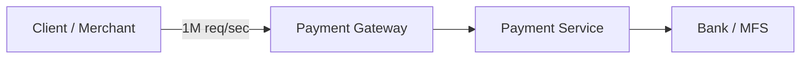

The requirement is brutally simple to state and brutally hard to deliver:

1. Accept the payment request durably.
2. Persist the transaction.
3. Create an event reliably.
4. Publish the event to Kafka.
5. Process the payment asynchronously.
6. Call downstream Bank/MFS systems.
7. Retry failures safely.
8. Avoid duplicate debit/payment processing.
9. Handle Kafka outages.
10. Handle database outages.
11. Handle relay crashes.
12. Handle consumer crashes.
13. Handle downstream bank throttling.
14. Scale horizontally.
15. Maintain observability and operational safety.

Notice that "not losing the request" and "not duplicating the debit" are both non-negotiable. In most systems you can trade consistency for availability. In payments, you can't — a lost payment is a support ticket and a broken customer relationship; a duplicated debit is a regulatory incident.

### Why the Naive Approach Fails

The instinctive first design looks like this:

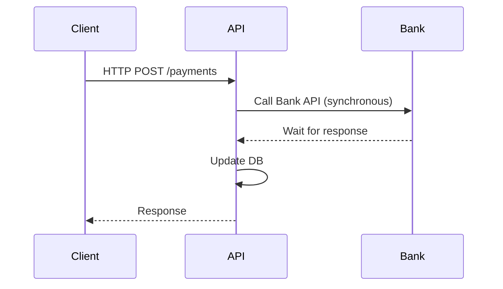

This works fine in a demo with ten requests. At 1M TPS it collapses for a set of very predictable reasons:

- **Thread exhaustion.** Every in-flight request holds a thread (or, with reactive stacks, a chunk of scheduler capacity) for the full duration of the bank call. If the bank takes 200ms to respond, you need roughly 200,000 concurrent in-flight requests just to sustain 1M TPS — that's an enormous amount of held state.
- **Connection pool exhaustion.** The HTTP client pool to the bank, and the DB connection pool, both get saturated. Once a pool is exhausted, new requests queue, and queuing under a synchronous call chain is how latency spirals turn into timeouts.
- **Slow downstream dependency.** The bank was never designed for 1M TPS. It might only sustain 10,000 TPS. A synchronous chain means the *slowest* component in the chain sets the ceiling for the *entire* system.
- **Timeout amplification.** The client sets a 5s timeout. The API sets a 4s timeout to the bank. Under load, the bank starts responding in 3.9s instead of 200ms. Now everything is on the edge of timing out simultaneously.
- **Retry storms.** Clients that time out retry. Now you've multiplied load on an already-saturated system. This is the classic feedback loop that turns a slowdown into an outage.
- **Cascading failures.** Thread pool exhaustion in the API cascades into connection pool exhaustion in the DB layer, which cascades into the load balancer marking instances unhealthy, which cascades into fewer instances handling more load.
- **Poor throughput.** You end up nowhere near 1M TPS — you get whatever the slowest synchronous dependency in the chain can sustain, times some safety margin that shrinks under load.
- **Duplicate payment risk.** When a client times out and doesn't know if the payment succeeded, the "safe" thing a naive client does is retry. If your API isn't idempotent, that's now two debits for one intended payment.

The fundamental design mistake is coupling **request acceptance** to **request processing**. Fix that coupling, and most of these problems become tractable.

---

## Why Asynchronous Processing (Not "Fire and Forget")

The fix is to separate two concerns that got tangled together:

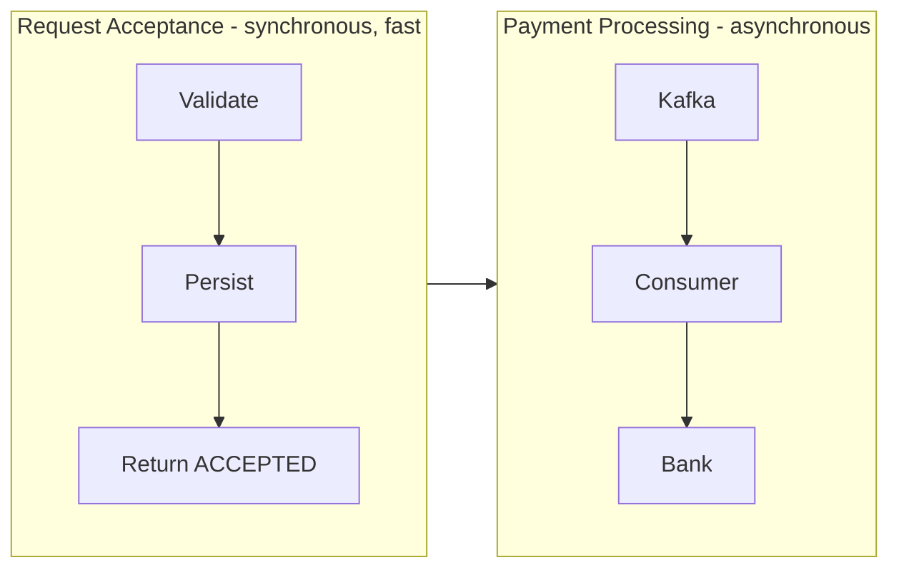

The API's only synchronous job becomes: validate the request, durably persist it, and respond. Everything involving the bank happens later, off the request thread.

```
POST /payments
{
  "transactionId": "TX10001",
  "amount": 5000,
  "currency": "BDT",
  "customerId": "CUST-8842"
}

Response (202 Accepted):
{
  "transactionId": "TX10001",
  "status": "ACCEPTED"
}
```

I want to be very explicit about something that gets glossed over constantly: **"asynchronous" does not mean "optional" or "best effort."** The transaction is not fire-and-forget. It *must* eventually be processed, exactly the way a courier company doesn't lose your parcel just because delivery happens the next day instead of instantly. Durability is guaranteed at acceptance time; completion is guaranteed eventually, with a well-defined state machine tracking it the whole way.

The lifecycle a client (or your own reconciliation system) should be able to query at any time:

```
ACCEPTED → PROCESSING → SUCCESS
                       → FAILED
                       → (RETRY loop back to PROCESSING)
```

with **reconciliation** as the safety net for anything that gets stuck or ambiguous, and **callbacks/webhooks** as the mechanism for informing the merchant asynchronously once a terminal state is reached.

This single architectural decision — decoupling acceptance from processing — is what turns "1M TPS" from an impossible synchronous chain into a tractable durability + eventual-processing problem. But decoupling introduces its own hard problem: how do you guarantee that "persist the transaction" and "publish the event that drives processing" either both happen or neither happens?

---

## The Transactional Outbox Pattern

### The Core Problem: Two Systems, One Guarantee

Here's the trap almost every team falls into first:

```java
@Transactional
public void createPayment(Payment payment) {
    paymentRepository.save(payment);
    kafkaTemplate.send("payment-topic", payment);
}
```

This looks correct. It compiles. It works in your local tests. It is fundamentally broken in production, because `paymentRepository.save()` participates in the database transaction, and `kafkaTemplate.send()` does not. You have two independent systems and no atomicity across them.

**Failure mode 1 — DB commits, Kafka publish never happens:**

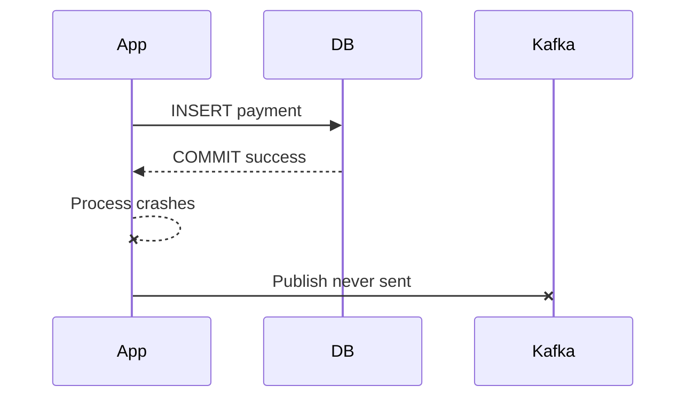

The payment is durably recorded, but nothing downstream ever learns about it. The bank is never called. The customer paid... into a black hole.

**Failure mode 2 — Kafka publish succeeds, DB transaction rolls back:**

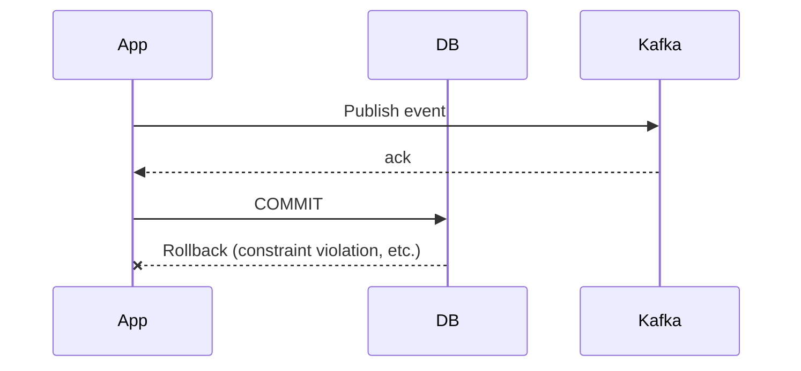

Now Kafka thinks a payment happened that, as far as the system of record is concerned, never did. A downstream consumer might call the bank for a transaction that doesn't exist in your database.

Both failure modes are not rare edge cases — under real production load, with real crashes, real deployments, and real network blips, they *will* happen. The question isn't whether, it's how often, and whether your architecture accounts for it.

### The Solution

The Transactional Outbox pattern sidesteps the two-system-atomicity problem by never trying to be atomic across two systems in the first place. Instead, it writes the event **into the same database, in the same transaction**, as an ordinary row in an `OUTBOX` table:

```sql
BEGIN TRANSACTION
  INSERT INTO payment_transaction (...) VALUES (...);
  INSERT INTO outbox (...) VALUES (...);
COMMIT;
```

Because both inserts are part of one local ACID transaction on the same database, they are atomic by construction — no distributed coordination protocol required. Either both rows exist, or neither does.

A separate process — the **Outbox Relay** — then reads unpublished rows from the outbox table and pushes them to Kafka, independently and asynchronously from the original request.

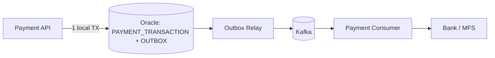

This is the foundation everything else in this article builds on. Every subsequent section is really answering one question: **how do you make this pattern fast, safe, and operable at extreme scale?**

---

## Database Design

Let's design the actual tables, Oracle-style, with production concerns baked in from the start.

### PAYMENT_TRANSACTION

```sql
CREATE TABLE payment_transaction (
    transaction_id     VARCHAR2(64)    NOT NULL,
    customer_id        VARCHAR2(64)    NOT NULL,
    amount              NUMBER(18,2)   NOT NULL,
    currency            VARCHAR2(3)    NOT NULL,
    status               VARCHAR2(20)  NOT NULL,
    idempotency_key      VARCHAR2(128) NOT NULL,
    created_at           TIMESTAMP     DEFAULT SYSTIMESTAMP NOT NULL,
    updated_at           TIMESTAMP     DEFAULT SYSTIMESTAMP NOT NULL,
    version               NUMBER        DEFAULT 0 NOT NULL,
    CONSTRAINT pk_payment_transaction PRIMARY KEY (transaction_id)
);

CREATE UNIQUE INDEX ux_payment_idempotency
    ON payment_transaction (idempotency_key);

CREATE INDEX ix_payment_customer_created
    ON payment_transaction (customer_id, created_at);
```

Column notes:

- `transaction_id` — the primary key, generated by the API (not the DB) so it can be returned in the synchronous ACCEPTED response before any async work happens.
- `idempotency_key` — supplied by the client (or derived from client + request fingerprint). The **unique index** on this column is what actually prevents duplicate payment creation if a client retries the same POST request. This is separate from Kafka-level idempotency, which we'll cover later — this one protects the API layer.
- `status` — the payment state machine value (`ACCEPTED`, `PROCESSING`, `SUCCESS`, `FAILED`, `UNKNOWN`).
- `version` — optimistic locking column, so concurrent state transitions (e.g., a retry job and a callback handler both trying to update the same row) don't silently clobber each other.

### OUTBOX

```sql
CREATE TABLE outbox (
    event_id        NUMBER          NOT NULL,
    transaction_id   VARCHAR2(64)   NOT NULL,
    event_type        VARCHAR2(50)  NOT NULL,
    aggregate_type      VARCHAR2(50) NOT NULL,
    payload              CLOB        NOT NULL,
    status                 VARCHAR2(20) DEFAULT 'NEW' NOT NULL,
    created_at              TIMESTAMP   DEFAULT SYSTIMESTAMP NOT NULL,
    claimed_at               TIMESTAMP,
    claimed_by                 VARCHAR2(100),
    published_at                TIMESTAMP,
    retry_count                   NUMBER DEFAULT 0 NOT NULL,
    last_error                      VARCHAR2(2000),
    CONSTRAINT pk_outbox PRIMARY KEY (event_id)
);
```

Column notes:

- `event_id` — surrogate key, typically an Oracle sequence or identity column. Not the transaction ID, because one transaction can eventually produce multiple events (created, retried, reversed, etc.).
- `event_type` — e.g. `PAYMENT_CREATED`, `PAYMENT_RETRY_REQUESTED`.
- `aggregate_type` — e.g. `PAYMENT`, useful once you have multiple outbox producers in the same schema.
- `payload` — the serialized event body (JSON). Stored as CLOB because payment payloads can carry metadata beyond a few hundred bytes.
- `status` — `NEW → PROCESSING → PUBLISHED` (with a path back to `NEW` on relay crash recovery, which we cover in the claiming section).
- `claimed_at` / `claimed_by` — who is currently working this row, and since when — this is the backbone of crash recovery.
- `retry_count` / `last_error` — for diagnosing and bounding retries on publish failures.

This table is where all the interesting scaling problems live, so let's go there next.

---

## Partitioning the Outbox

### Why a Single Table Breaks Down

At 1M TPS, the outbox table isn't a small lookup table — it's ingesting up to a million rows a second at peak, and even with aggressive cleanup, you're routinely dealing with hundreds of millions to billions of rows in flight or awaiting archival.

```
OUTBOX
------------------------
10,000,000,000+ rows (order of magnitude at scale)
```

A single monolithic table, and a single B-tree index on `(status, created_at)`, becomes a serialization point. Every relay worker is fighting over the same hot index blocks, the same leading edge of the table, and the same undo/redo generation. Insert throughput degrades, index maintenance overhead grows, and a single stuck query can scan far more than it needs to.

### Hash Partitioning for Write Distribution

Oracle table partitioning lets you split one logical table into many physical segments, each with its own storage, its own (local) indexes, and — critically — independent hot spots.

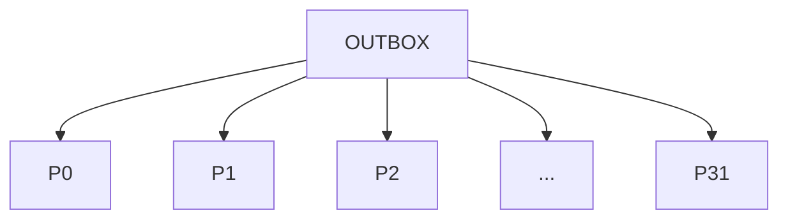

```sql
CREATE TABLE outbox (
    event_id        NUMBER          NOT NULL,
    transaction_id   VARCHAR2(64)   NOT NULL,
    event_type        VARCHAR2(50)  NOT NULL,
    payload             CLOB        NOT NULL,
    status                VARCHAR2(20) NOT NULL,
    created_at             TIMESTAMP  NOT NULL,
    claimed_at              TIMESTAMP,
    claimed_by                VARCHAR2(100),
    published_at               TIMESTAMP,
    retry_count                  NUMBER DEFAULT 0,
    last_error                    VARCHAR2(2000)
)
PARTITION BY HASH (transaction_id)
PARTITIONS 32;
```

Conceptually, Oracle computes something equivalent to:

```
partition_number = hash(transaction_id) MOD 32
```

and routes each row deterministically to that partition. This buys you several concrete things:

- **Write distribution** — inserts from many concurrent API instances spread across 32 independent physical segments instead of contending on one.
- **Parallel relay processing** — relay workers can each be assigned a subset of partitions, so they claim and process rows without stepping on each other's index ranges.
- **Partition pruning** — if a query can be scoped to a specific `transaction_id` (or a small set of them), Oracle can skip scanning the other 31 partitions entirely.
- **Partition-level maintenance** — you can rebuild, analyze, or (later) drop a single partition without touching the other 31, which matters enormously for archival (more on that below).

### Local vs. Global Indexes

With hash partitioning, you generally want **local indexes** — one index segment per partition, aligned with the table's partitioning scheme:

```sql
CREATE INDEX ix_outbox_status_created
    ON outbox (status, created_at) LOCAL;
```

A local index avoids the classic problem of a **global index** becoming its own single point of contention — a global index on a partitioned table is still one logical structure, and under extreme concurrent DML it can become just as much of a bottleneck as the unpartitioned table you were trying to escape. Local indexes trade a small amount of query flexibility (you sometimes need to probe more segments) for a large amount of concurrent-write scalability, which is almost always the right trade for a write-heavy outbox.

### Hot Partitions and Choosing Partition Count

Hash partitioning is only as good as the hash function's distribution. If `transaction_id` values are generated with a pattern (e.g., a shared numeric prefix per day or per merchant), you can end up with skewed partitions — a "hot" partition absorbing disproportionate write load while others sit idle. This is why `transaction_id` should be a well-distributed value (a UUID or a hashed/randomized ID), not a monotonically increasing sequence, if it's going to be your hash partitioning key.

Partition count is a genuine sizing exercise, not a magic number. Sixteen, thirty-two, sixty-four — the right number depends on:

- How many relay workers you plan to run concurrently (partitions should be a multiple of worker count, or workers will have unbalanced assignments).
- The realistic concurrency your Oracle instance can sustain without index/segment contention.
- Operational overhead — more partitions means more objects to manage, monitor, and back up.

### Time-Based Partitioning for Lifecycle Management

Hash partitioning solves write distribution. It does *not* solve the "the table is enormous and needs to be pruned" problem, because a given hash partition contains rows from every point in time. For that, many production systems use **composite partitioning** — hash for write distribution, sub-partitioned or combined with range partitioning by date for lifecycle management:

```sql
CREATE TABLE outbox (
    event_id        NUMBER,
    transaction_id   VARCHAR2(64),
    event_type        VARCHAR2(50),
    payload             CLOB,
    status                VARCHAR2(20),
    created_at             TIMESTAMP,
    claimed_at              TIMESTAMP,
    claimed_by                VARCHAR2(100),
    published_at               TIMESTAMP,
    retry_count                  NUMBER DEFAULT 0,
    last_error                    VARCHAR2(2000)
)
PARTITION BY RANGE (created_at)
SUBPARTITION BY HASH (transaction_id) SUBPARTITIONS 32
(
    PARTITION p_2026_08_15 VALUES LESS THAN (TIMESTAMP '2026-08-16 00:00:00'),
    PARTITION p_2026_08_16 VALUES LESS THAN (TIMESTAMP '2026-08-17 00:00:00'),
    PARTITION p_2026_08_17 VALUES LESS THAN (TIMESTAMP '2026-08-18 00:00:00')
);
```

Now you get write distribution *and* the ability to drop an entire day's worth of published, archived events with a single `ALTER TABLE ... DROP SUBPARTITION`-style operation, which is dramatically cheaper than a row-by-row `DELETE`.

### What Partitioning Does *Not* Do

I want to be blunt here, because this is where a lot of architecture decks quietly lie: **partitioning alone does not give you 1M TPS.** Partitioning improves distribution, manageability, and parallelism *within the capacity your hardware already has*. It does not add CPU cores, IOPS, redo log throughput, or network bandwidth. We'll come back to this in Section "The Critical Limitation," because it's the single most important caveat in this entire article.

---

## Shared Database: What It Actually Means Here

To be explicit about the architectural assumption running through this article:

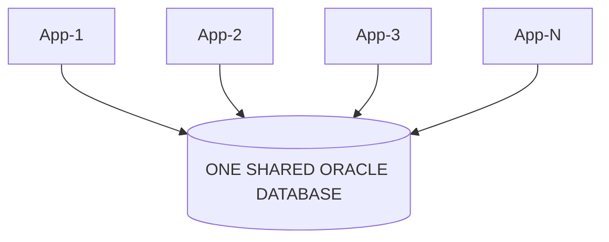

There is **no database sharding** in this design — yet. Every application instance, every relay worker, every consumer connects to the same logical Oracle database. Table partitioning distributes rows *within* that single database instance; it is an internal storage and access optimization, invisible to the application beyond faster, more parallel query plans.

This is fundamentally different from sharding, where you deliberately split data across **separate database instances** (potentially on separate hardware, separate storage, separate failure domains) based on some shard key, and the application has to know which shard to talk to.

| Aspect | Table Partitioning | Database Sharding |
|---|---|---|
| Scope | Within one database instance | Across multiple database instances |
| Application awareness | Transparent — app just queries the table | App (or a routing layer) must know the shard key and target instance |
| Hardware capacity | Bound by one instance's CPU/IOPS/memory | Scales by adding more instances |
| Operational complexity | Moderate — partition maintenance | High — cross-shard queries, rebalancing, distributed transactions |
| Cross-partition transactions | Native (single DB transaction) | Requires distributed coordination or careful design to avoid |
| When to reach for it | Almost always first, for manageability and parallelism | When a single instance's hardware ceiling is the actual bottleneck |

This is the order most successful teams follow, and it's the order this article follows too: exhaust what partitioning inside one well-resourced database can give you before taking on the operational cost of sharding.

---

## Outbox Relay Architecture

The Outbox Relay is the process that turns rows sitting in the `OUTBOX` table into events sitting in Kafka. It is deliberately a *separate* process from the API — it polls (or, later, subscribes via CDC) independently of request handling.

### Why One Relay Instance Isn't Enough

A single relay instance polling the outbox table, however well-written, has a hard ceiling: it's fundamentally one thread of I/O against the database and one producer connection to Kafka. Even with internal concurrency, one process on one machine has finite CPU, network, and connection-pool capacity.

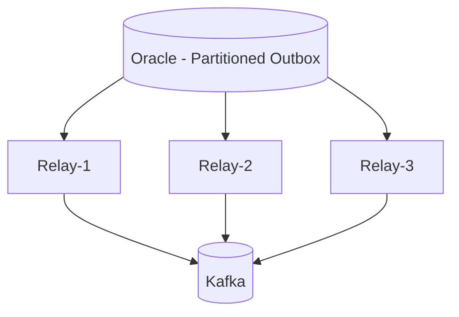

Running a **cluster of relay instances**, each independently polling and claiming rows, is what lets relay throughput scale roughly linearly (up to the point where the database itself becomes the constraint — see below).

### The Knobs That Actually Matter

- **Batch size** — how many rows a relay claims per poll cycle. Too small (e.g., 10) and you pay per-round-trip overhead for every batch; too large (e.g., 50,000) and a single claim transaction holds locks longer than necessary and creates large, bursty Kafka publish batches. A batch size in the low thousands is a reasonable starting point, tuned against actual measured claim and publish latency.
- **Poll interval** — how often an idle relay checks for new rows. Too aggressive and idle relays waste database round-trips; too relaxed and you add latency to the "acceptance to Kafka publish" path. Many production systems use a short poll interval when a queue was recently non-empty and back off when it's been empty for a while.
- **Number of relay instances** — should roughly track the number of outbox partitions (or a clean divisor of it), so each relay instance can be assigned a stable subset of partitions and avoid all instances hammering the same partitions.
- **DB connection pool per relay** — each relay needs its own bounded pool; an unbounded pool is how one misbehaving relay instance starves the database for every other component.
- **Kafka producer batching** — `linger.ms` and `batch.size` on the Kafka producer side, tuned so the relay's DB-batch and Kafka-batch cadences complement rather than fight each other.
- **Backpressure** — if Kafka or the bank-side consumers are falling behind, the relay should not keep claiming rows faster than the pipeline can drain, or it just relocates the queue from the `OUTBOX` table's `NEW` status into an equally large `PROCESSING`/in-flight buffer.

A rough throughput model: if a single relay instance can sustain claiming and publishing 20,000 rows/sec (a hypothetical, benchmark-dependent number), you'd need on the order of 50 relay instances to sustain 1M TPS *if* the database and Kafka cluster underneath can actually support that aggregate load — which is a big "if" we'll revisit in the capacity planning section.

---

## The Most Important Part: Row Claiming

### The Concurrency Problem

With multiple relay instances polling the same table, the naive approach — `SELECT` unclaimed rows, then process them — has an obvious race:

```
Relay-1 → reads Event 100 (status = NEW)
Relay-2 → reads Event 100 (status = NEW)
```

Both relays see the row as unclaimed, both publish it to Kafka. Duplicate publication.

### FOR UPDATE SKIP LOCKED

Oracle's `FOR UPDATE SKIP LOCKED` is built exactly for this pattern — multiple workers competing for a shared queue of rows, where you want each row processed by exactly one worker at a time, and you want workers to never block each other.

```sql
SELECT
    event_id,
    transaction_id,
    event_type,
    payload
FROM outbox
WHERE status = 'NEW'
ORDER BY created_at
FETCH FIRST 1000 ROWS ONLY
FOR UPDATE SKIP LOCKED;
```

What happens under the hood:

- `FOR UPDATE` acquires row-level locks on the rows selected.
- `SKIP LOCKED` tells Oracle: if a row is already locked by another session, don't wait for it — silently skip it and move on to the next eligible row.
- The `ORDER BY created_at ... FETCH FIRST N ROWS` combination means each relay tends to grab a contiguous-ish "next" slice of work rather than randomly scattered rows.

Concretely, with two relays running concurrently:

```
Relay-1 locks event_ids 1001–2000
Relay-2 attempts the same query
  → sees 1001–2000 are locked → skips them
  → locks event_ids 2001–3000 instead
```

Neither relay blocks waiting on the other. Neither relay double-processes the same rows. This is what makes horizontal relay scaling actually work instead of just adding contention.

---

## Don't Hold Database Locks While Calling Kafka

This is the single most important operational rule in this entire architecture, and it's the one most likely to be violated by a team's first implementation.

### Why This Is Catastrophic

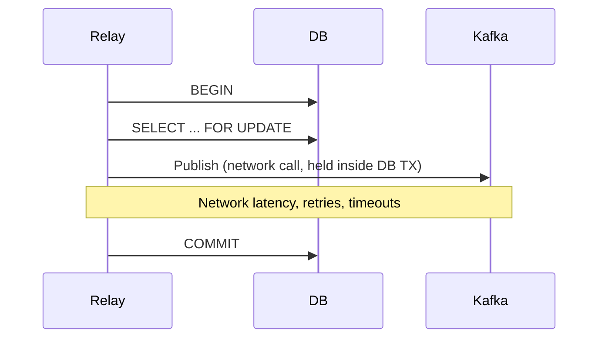

If the `SELECT ... FOR UPDATE` transaction stays open for the entire duration of the Kafka publish call, you've turned a fast, bounded database operation into one whose duration is governed by network I/O to an entirely different system. The consequences compound quickly:

- **Long-held transactions** mean long-held row locks — other relays skip those rows (fine), but the lock duration itself now scales with Kafka latency, not database latency.
- **DB connections stay checked out** for the full round trip, shrinking your effective connection pool under exactly the conditions (Kafka slowness) where you need database throughput the most.
- **Lock contention and undo/redo pressure** grow, because Oracle has to maintain the transaction's read consistency and rollback segment for a duration that's now unpredictable.
- **Throughput collapses**, because the system's effective serialization point becomes "however slow the *slowest* Kafka publish call currently in flight is," rather than "however fast Oracle can process a claim."

### The Fix: Claim → Commit → Publish


The claim step is a short, bounded database transaction. It flips status to `PROCESSING` and commits immediately — releasing all locks — *before* any Kafka network call happens.

```sql
UPDATE outbox
SET
    status = 'PROCESSING',
    claimed_by = :relay_id,
    claimed_at = SYSTIMESTAMP
WHERE event_id IN (
    SELECT event_id
    FROM outbox
    WHERE status = 'NEW'
    ORDER BY created_at
    FETCH FIRST 1000 ROWS ONLY
    FOR UPDATE SKIP LOCKED
);

COMMIT;
```

Only *after* this commits does the relay start publishing the claimed batch to Kafka, entirely outside of any open database transaction. This decouples database throughput from Kafka/network latency completely — the database is never waiting on the network, and the network call is never holding a lock.

---

## What Happens When a Relay Crashes?

This is where the "claim, commit, publish" design earns its complexity. Consider:

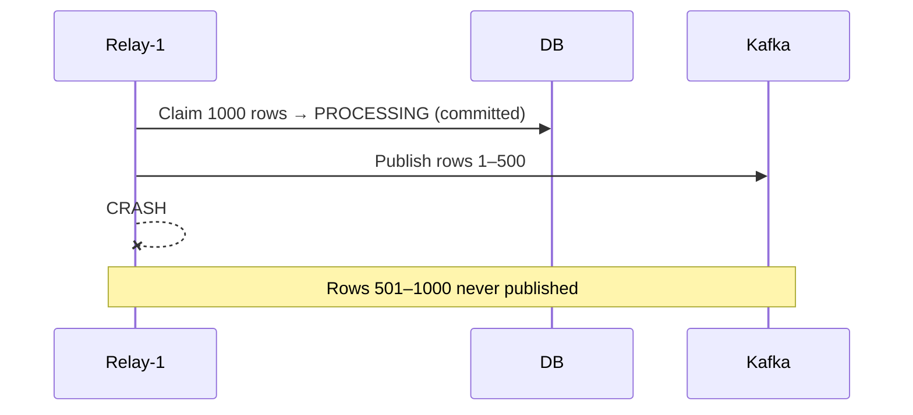

The database has no way of knowing, at the moment of the crash, exactly which of the 1000 claimed rows actually made it to Kafka. This is an inherent property of the design — once you've committed the claim and released the lock, you've traded "guaranteed exactly-once knowledge" for "no lock held during network I/O," and that trade is the right one, but it needs a safety net.

### Stale Claim Recovery

The safety net is a recovery job that periodically reclaims rows stuck in `PROCESSING` for too long:

```sql
UPDATE outbox
SET
    status = 'NEW',
    claimed_by = NULL,
    claimed_at = NULL
WHERE status = 'PROCESSING'
AND claimed_at < SYSTIMESTAMP - INTERVAL '5' MINUTE;
```

The 5-minute figure is not a number you should copy-paste into production. It needs to be derived from your actual observed claim-to-publish latency distribution — set it too short, and you'll reclaim (and potentially re-publish) rows that a slow-but-healthy relay is still legitimately working on; set it too long, and a crashed relay's rows sit un-retried for an unacceptable amount of time. A common approach is to set the lease timeout to a comfortable multiple (5–10x) of your observed p99 claim-to-publish duration, and to alert separately if reclaimed rows start appearing at an unusual rate — that's a signal of relay instability, not just normal crash-recovery churn.

---

## At-Least-Once Delivery

The recovery mechanism above has a direct consequence you need to design around, not around it:

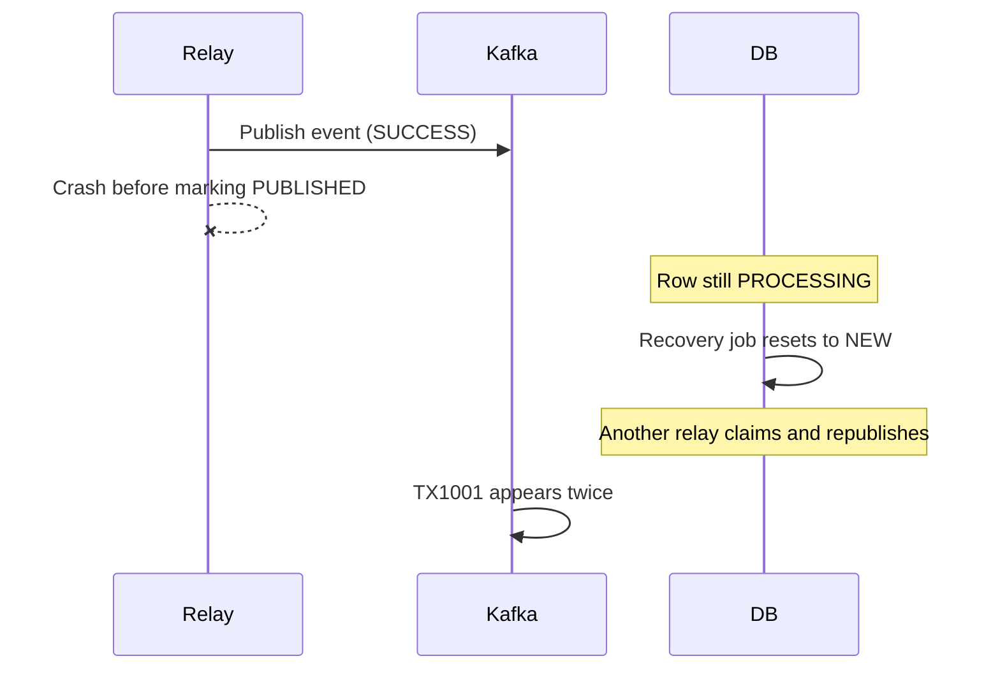

The outbox pattern, combined with crash recovery, gives you **at-least-once delivery** to Kafka — not exactly-once. A given transaction's event can, under real crash scenarios, be published more than once. This is not a bug to be engineered away at the relay layer; it's a fundamental consequence of not holding locks across network calls (which, as established, you must not do). The only correct place to handle this is downstream, at the consumer.

---

## Idempotent Payment Consumer

### Why "Exactly Once" Isn't a Free Lunch

It's tempting to reach for Kafka's idempotent producer or Kafka transactions and declare the duplication problem solved. It isn't — those mechanisms guarantee exactly-once *delivery semantics within Kafka's own broker/producer/consumer protocol*, not exactly-once *business effect* across a system that spans Oracle, the relay, Kafka, and a downstream bank call. The moment your business logic (calling the bank, updating a balance) sits outside of Kafka's transactional boundary — which it necessarily does, because the bank is not a Kafka participant — you're back to needing idempotency at the business layer.

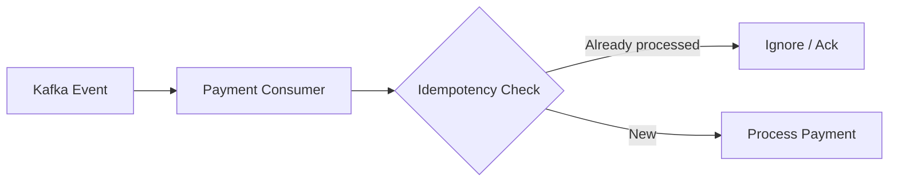

### Idempotency Table

```sql
CREATE TABLE processed_payment_event (
    event_id        VARCHAR2(100)  NOT NULL,
    transaction_id   VARCHAR2(64)  NOT NULL,
    processed_at      TIMESTAMP    NOT NULL,
    CONSTRAINT pk_processed_payment_event PRIMARY KEY (event_id)
);
```

The consumer's flow, per event:

```
First delivery:
  TX1001 (event_id = E-9001) → not in processed_payment_event
                              → process payment
                              → INSERT into processed_payment_event

Duplicate delivery:
  TX1001 (event_id = E-9001) → already in processed_payment_event
                              → skip processing, just ack the Kafka offset
```

The `event_id` primary key (not the `transaction_id`) is deliberately the idempotency boundary here, because a legitimate retry flow might generate a *new* event for the *same* transaction (e.g., a retry-topic redelivery) — you want to dedupe exact redeliveries of the same event, while still allowing legitimate new attempts to reach the bank through your controlled retry logic, not silently swallow them.

The insert into `processed_payment_event` and the payment-processing side effect (e.g., updating `payment_transaction.status`) should happen in the *same local database transaction*, so a crash between "processed the payment" and "recorded that we processed it" can't itself reintroduce a duplicate-processing window.

This is the crux of **exactly-once business effect versus exactly-once message delivery**: you accept that the message might arrive more than once, and you make the effect of processing it idempotent, so arriving twice doesn't produce two debits.

---

## Payment State Machine

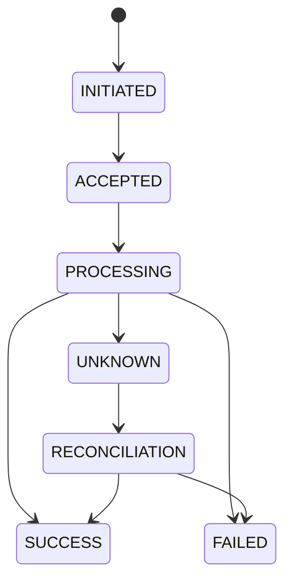

The state most teams forget to design for is `UNKNOWN`. Consider:

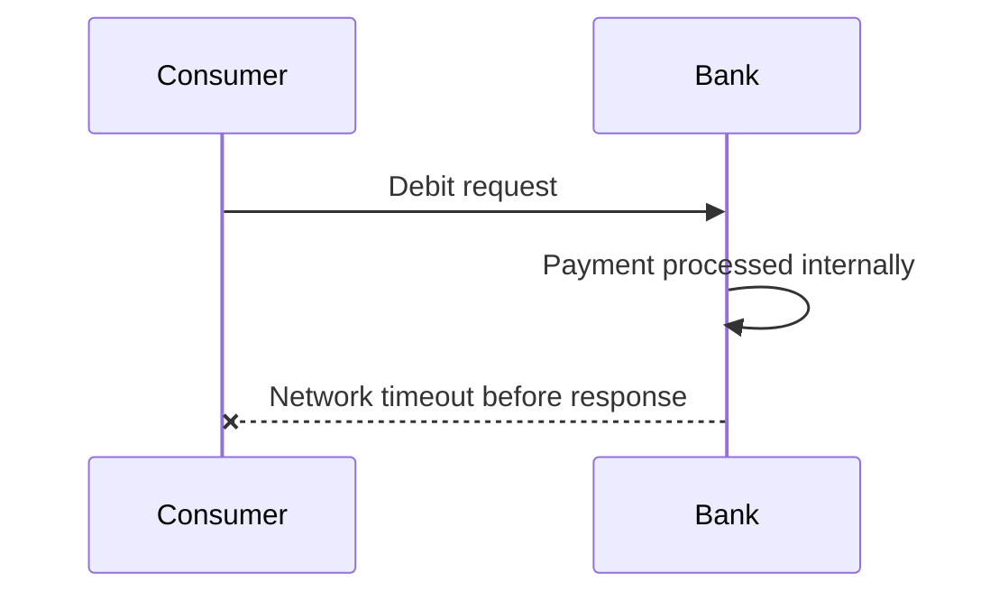

From the gateway's point of view, the bank call timed out. But "the bank call timed out" and "the bank did not process the payment" are **not the same fact**. The bank may have processed it and the response was lost in transit. If the consumer's failure handling treats a timeout the same as a definite failure and blindly retries the debit, you risk a real duplicate debit at the bank — the one failure mode that's hardest to reverse and most damaging to a customer relationship.

The correct behavior on ambiguous failure is to move the transaction to `UNKNOWN`, **not** retry the debit automatically, and route it into a **reconciliation** process — typically a scheduled job that queries the bank's status API (a read-only, idempotent-by-nature operation) for any transaction sitting in `UNKNOWN` past a threshold, and resolves it to `SUCCESS` or `FAILED` based on the bank's authoritative answer.

---

## Kafka Design

### Topic Layout

```
payment-events        -- primary event stream
payment-events-retry   -- backoff/retry topic
payment-events-dlq      -- dead-letter queue for exhausted retries
```

- **Partitions** — the number of partitions bounds your maximum consumer parallelism (one partition can only be actively consumed by one consumer instance within a consumer group at a time). A rough capacity model: at 1,000,000 events/sec across 100 partitions, you're looking at roughly 10,000 events/sec/partition. This is a coarse estimate — actual per-partition throughput depends heavily on payload size, broker disk/network characteristics, replication factor, and producer batching, and should be validated with real benchmarking against your actual broker hardware, not assumed from this formula alone.
- **Replication factor** — typically 3 in production, for durability against broker failure. Replication factor directly multiplies your physical storage and network requirements (see capacity planning below).
- **Message key** — using `transaction_id` as the Kafka message key ensures all events for the same transaction land on the same partition, which gives you **ordering guarantees for events belonging to one transaction** (e.g., a `PAYMENT_CREATED` event and a subsequent `PAYMENT_RETRY_REQUESTED` event for the same transaction are processed in order), without needing global ordering across the whole topic.
- **Consumer group / concurrency** — the consumer group should generally run at least as many consumer instances (or consumer threads, up to partition count) as there are partitions, to fully parallelize consumption.
- **Retry topic** — failed processing attempts get republished to a retry topic with a backoff delay, rather than blocking the main partition's offset progression on a single stuck message.
- **DLQ** — after a bounded number of retry attempts, an event that still can't be processed moves to a dead-letter topic for manual/automated investigation, so it doesn't block the pipeline indefinitely.

### Producer Configuration

```properties
acks=all
enable.idempotence=true
retries=2147483647
delivery.timeout.ms=120000
linger.ms=5
batch.size=65536
compression.type=snappy
max.in.flight.requests.per.connection=5
```

- **`acks=all`** — the producer waits for acknowledgment from all in-sync replicas, not just the leader, before considering the write successful. This is the durability trade-off you want for payment events; weaker acks settings favor latency over the guarantee that a broker failure won't silently lose an acknowledged write.
- **`enable.idempotence=true`** — enables the Kafka producer's built-in deduplication for retried sends *at the producer-to-broker level* — this prevents a producer-side network retry from creating duplicate messages *within a single producer session*. It does **not** protect against the outbox-relay-level duplication discussed earlier (a whole separate relay instance republishing after a crash) — that's a different layer of the system and needs the consumer-side idempotency table.
- **`retries` / `delivery.timeout.ms`** — bound how long and how persistently the producer retries a failed send before giving up and surfacing an error to the relay.
- **`linger.ms` / `batch.size`** — control how the producer batches messages for throughput versus latency; higher values improve throughput at the cost of added per-message latency.
- **`compression.type`** — reduces network and broker storage load; `snappy` or `lz4` are common choices for a good throughput/CPU trade-off, but the right choice depends on payload characteristics.
- **`max.in.flight.requests.per.connection=5`** — the maximum value that still preserves ordering guarantees when idempotence is enabled; higher throughput comes from batching and broker/network capacity, not from raising this further.

Every one of these numbers should be treated as a starting point for benchmarking against your actual broker cluster and payload shapes — not as a value to copy verbatim into a production config.

---

## Java 21 + Spring Boot Implementation

### Entities

```java
@Entity
@Table(name = "payment_transaction")
public class Payment {

    @Id
    @Column(name = "transaction_id")
    private String transactionId;

    @Column(name = "customer_id", nullable = false)
    private String customerId;

    @Column(name = "amount", nullable = false)
    private BigDecimal amount;

    @Column(name = "currency", nullable = false)
    private String currency;

    @Enumerated(EnumType.STRING)
    @Column(name = "status", nullable = false)
    private PaymentStatus status;

    @Column(name = "idempotency_key", nullable = false, unique = true)
    private String idempotencyKey;

    @Column(name = "created_at", nullable = false)
    private Instant createdAt;

    @Column(name = "updated_at", nullable = false)
    private Instant updatedAt;

    @Version
    @Column(name = "version")
    private Long version;

    // getters/setters omitted for brevity
}
```

```java
@Entity
@Table(name = "outbox")
public class OutboxEvent {

    @Id
    @GeneratedValue(strategy = GenerationType.SEQUENCE, generator = "outbox_seq")
    @SequenceGenerator(name = "outbox_seq", sequenceName = "outbox_seq", allocationSize = 50)
    @Column(name = "event_id")
    private Long eventId;

    @Column(name = "transaction_id", nullable = false)
    private String transactionId;

    @Column(name = "event_type", nullable = false)
    private String eventType;

    @Column(name = "aggregate_type", nullable = false)
    private String aggregateType;

    @Lob
    @Column(name = "payload", nullable = false)
    private String payload;

    @Column(name = "status", nullable = false)
    private String status;

    @Column(name = "created_at", nullable = false)
    private Instant createdAt;

    @Column(name = "claimed_at")
    private Instant claimedAt;

    @Column(name = "claimed_by")
    private String claimedBy;

    @Column(name = "published_at")
    private Instant publishedAt;

    @Column(name = "retry_count", nullable = false)
    private Integer retryCount = 0;

    @Column(name = "last_error")
    private String lastError;

    // getters/setters omitted for brevity
}
```

### The Critical Transaction: Accept a Payment

```java
@Service
public class PaymentService {

    private final PaymentRepository paymentRepository;
    private final OutboxRepository outboxRepository;
    private final ObjectMapper objectMapper;

    public PaymentService(PaymentRepository paymentRepository,
                           OutboxRepository outboxRepository,
                           ObjectMapper objectMapper) {
        this.paymentRepository = paymentRepository;
        this.outboxRepository = outboxRepository;
        this.objectMapper = objectMapper;
    }

    @Transactional
    public PaymentResponse createPayment(CreatePaymentRequest request) {

        // 1. Validate request (basic checks; deeper checks precede this call)
        Objects.requireNonNull(request.amount(), "amount is required");

        // 2. Generate transaction ID
        String transactionId = TransactionIdGenerator.next();

        // 3. Insert payment
        Payment payment = new Payment();
        payment.setTransactionId(transactionId);
        payment.setCustomerId(request.customerId());
        payment.setAmount(request.amount());
        payment.setCurrency(request.currency());
        payment.setStatus(PaymentStatus.ACCEPTED);
        payment.setIdempotencyKey(request.idempotencyKey());
        payment.setCreatedAt(Instant.now());
        payment.setUpdatedAt(Instant.now());
        paymentRepository.save(payment);

        // 4. Insert outbox event — SAME transaction, no Kafka call here
        OutboxEvent event = new OutboxEvent();
        event.setTransactionId(transactionId);
        event.setEventType("PAYMENT_CREATED");
        event.setAggregateType("PAYMENT");
        event.setPayload(toJson(payment));
        event.setStatus("NEW");
        event.setCreatedAt(Instant.now());
        outboxRepository.save(event);

        // 5. Commit happens automatically at method exit (Spring @Transactional)

        // 6. Return ACCEPTED
        return new PaymentResponse(transactionId, PaymentStatus.ACCEPTED);
    }

    private String toJson(Payment payment) {
        try {
            return objectMapper.writeValueAsString(payment);
        } catch (JsonProcessingException e) {
            throw new IllegalStateException("Failed to serialize payment event", e);
        }
    }
}
```

Notice what's conspicuously absent from this method: any call to `kafkaTemplate.send(...)`. That is intentional and non-negotiable — no network call to Kafka happens inside this database transaction.

### Outbox Relay

```java
@Component
public class OutboxRelay {

    private final JdbcTemplate jdbcTemplate;
    private final KafkaTemplate<String, String> kafkaTemplate;
    private final String relayId = "relay-" + UUID.randomUUID();

    private static final int BATCH_SIZE = 1000;

    public OutboxRelay(JdbcTemplate jdbcTemplate, KafkaTemplate<String, String> kafkaTemplate) {
        this.jdbcTemplate = jdbcTemplate;
        this.kafkaTemplate = kafkaTemplate;
    }

    @Scheduled(fixedDelay = 200) // poll interval, tuned per environment
    public void poll() {
        List<OutboxRow> claimed = claimBatch();
        if (claimed.isEmpty()) {
            return;
        }
        publishBatch(claimed);
    }

    @Transactional
    public List<OutboxRow> claimBatch() {
        String claimSql = """
            UPDATE outbox
            SET status = 'PROCESSING', claimed_by = ?, claimed_at = SYSTIMESTAMP
            WHERE event_id IN (
                SELECT event_id FROM outbox
                WHERE status = 'NEW'
                ORDER BY created_at
                FETCH FIRST ? ROWS ONLY
                FOR UPDATE SKIP LOCKED
            )
            """;
        jdbcTemplate.update(claimSql, relayId, BATCH_SIZE);
        // Transaction commits here (method returns), releasing locks
        // before any Kafka network call happens.
        return fetchClaimedRows();
    }

    private List<OutboxRow> fetchClaimedRows() {
        return jdbcTemplate.query(
            "SELECT event_id, transaction_id, event_type, payload " +
            "FROM outbox WHERE status = 'PROCESSING' AND claimed_by = ?",
            (rs, rowNum) -> new OutboxRow(
                rs.getLong("event_id"),
                rs.getString("transaction_id"),
                rs.getString("event_type"),
                rs.getString("payload")
            ),
            relayId
        );
    }

    private void publishBatch(List<OutboxRow> rows) {
        for (OutboxRow row : rows) {
            try {
                kafkaTemplate.send("payment-events", row.transactionId(), row.payload())
                    .whenComplete((result, ex) -> {
                        if (ex == null) {
                            markPublished(row.eventId());
                        } else {
                            recordFailure(row.eventId(), ex.getMessage());
                        }
                    });
            } catch (Exception e) {
                recordFailure(row.eventId(), e.getMessage());
            }
        }
    }

    private void markPublished(Long eventId) {
        jdbcTemplate.update(
            "UPDATE outbox SET status = 'PUBLISHED', published_at = SYSTIMESTAMP WHERE event_id = ?",
            eventId);
    }

    private void recordFailure(Long eventId, String error) {
        jdbcTemplate.update(
            "UPDATE outbox SET retry_count = retry_count + 1, last_error = ? WHERE event_id = ?",
            error, eventId);
        // status intentionally left as PROCESSING; the stale-claim
        // recovery job will requeue it after the lease timeout,
        // or a dedicated fast-fail path can reset it immediately.
    }
}
```

### Stale Claim Recovery Scheduler

```java
@Component
public class OutboxRecoveryScheduler {

    private final JdbcTemplate jdbcTemplate;

    public OutboxRecoveryScheduler(JdbcTemplate jdbcTemplate) {
        this.jdbcTemplate = jdbcTemplate;
    }

    @Scheduled(fixedDelay = 60000) // run every minute; tune per observed lease duration
    public void recoverStaleClaims() {
        jdbcTemplate.update("""
            UPDATE outbox
            SET status = 'NEW', claimed_by = NULL, claimed_at = NULL
            WHERE status = 'PROCESSING'
            AND claimed_at < ? 
            """, Timestamp.from(Instant.now().minus(Duration.ofMinutes(5))));
    }
}
```

### Idempotent Consumer

```java
@Component
public class PaymentEventConsumer {

    private final ProcessedEventRepository processedEventRepository;
    private final PaymentProcessor paymentProcessor;

    public PaymentEventConsumer(ProcessedEventRepository processedEventRepository,
                                 PaymentProcessor paymentProcessor) {
        this.processedEventRepository = processedEventRepository;
        this.paymentProcessor = paymentProcessor;
    }

    @KafkaListener(topics = "payment-events", groupId = "payment-processor")
    @Transactional
    public void onMessage(ConsumerRecord<String, String> record) {
        String eventId = extractEventId(record);

        if (processedEventRepository.existsById(eventId)) {
            // Duplicate delivery — already processed, safe to skip.
            return;
        }

        PaymentEvent event = deserialize(record.value());
        paymentProcessor.process(event); // may call the bank connector

        processedEventRepository.save(new ProcessedPaymentEvent(
            eventId, event.transactionId(), Instant.now()));
        // Both the business effect and the idempotency marker commit
        // together in this local transaction.
    }

    private String extractEventId(ConsumerRecord<String, String> record) {
        // derived from Kafka headers or embedded in the payload
        return String.valueOf(record.offset()) + "-" + record.partition();
    }

    private PaymentEvent deserialize(String json) {
        // JSON deserialization omitted for brevity
        return PaymentEvent.fromJson(json);
    }
}
```

### On Virtual Threads and `@Scheduled` vs. Executors

Java 21's virtual threads are genuinely useful here — they make it cheap to run many concurrent claim/publish cycles without the memory overhead of platform threads, which is helpful when a relay instance is managing many in-flight Kafka publish callbacks. But it's worth being precise about what they do and don't fix: virtual threads reduce the *cost of concurrency at the application layer*. They do not increase Oracle's IOPS, Kafka's broker throughput, or the bank's processing capacity. A relay built on virtual threads that claims batches faster than Kafka can absorb them just produces backpressure somewhere else in the pipeline — it doesn't eliminate the underlying capacity constraint. Use virtual threads to make your I/O-bound relay and consumer code simpler and more efficient at high concurrency; don't expect them to raise your system's true throughput ceiling.

---

## Database Indexing

```sql
CREATE INDEX ix_outbox_status_created
    ON outbox (status, created_at) LOCAL;

CREATE INDEX ix_outbox_status_claimed
    ON outbox (status, claimed_at) LOCAL;

CREATE INDEX ix_outbox_transaction_id
    ON outbox (transaction_id) LOCAL;
```

- `(status, created_at)` — supports the claim query's `WHERE status = 'NEW' ORDER BY created_at`.
- `(status, claimed_at)` — supports the stale-claim recovery query's `WHERE status = 'PROCESSING' AND claimed_at < ...`.
- `(transaction_id)` — supports lookups and joins back to `payment_transaction`, and benefits from partition pruning since it aligns with the hash partitioning key.

The trap to avoid: **adding indexes blindly.** Every additional index is additional write amplification — every `INSERT` and every claim `UPDATE` now has to maintain that index too. On a table taking a million writes a second, an unnecessary index isn't a minor cost; it's a direct, multiplicative tax on your write throughput ceiling. Index only the access patterns you actually have queries for, prefer local over global indexes on a partitioned table, and periodically review index usage statistics to catch indexes that stopped earning their keep.

---

## Outbox Cleanup and Archival

The `OUTBOX` table cannot grow forever. Rows move through `NEW → PROCESSING → PUBLISHED`, but `PUBLISHED` rows still occupy space, still get scanned during recovery-job full-status-column filtering (if not indexed carefully), and still count against your backup and storage budgets.

The strategy that pairs naturally with time-based partitioning (from the earlier composite partitioning design) is **partition-based retention**:

```
OUTBOX_2026_08_15
OUTBOX_2026_08_16
OUTBOX_2026_08_17
```

Instead of running a `DELETE FROM outbox WHERE published_at < ...` — which is a slow, row-by-row operation that generates enormous undo/redo and fights with live traffic for locks — you drop or archive an entire day's partition once it's outside your retention window:

```sql
ALTER TABLE outbox DROP PARTITION p_2026_08_10;
```

For compliance and audit needs, "drop" is usually preceded by an **archive** step — exporting the partition's data to cold storage (object storage, a dedicated audit schema, etc.) before dropping it from the live table, since many payment regulatory regimes require retaining transaction event history for a period well beyond what you'd want sitting in your hot operational table.

---

## Backpressure: The Bank Is the Real Ceiling

Here's a scenario every payment architecture eventually has to confront honestly:

```
Incoming:      1,000,000 TPS
Bank capacity:    10,000 TPS
```

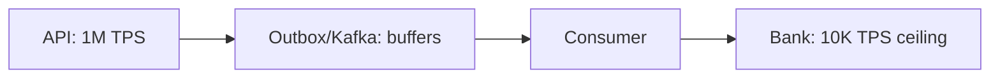

Kafka and the outbox absorb the *burst* — that's exactly what a durable queue is for. But absorbing a burst is not the same as increasing the downstream system's actual capacity. If the bank can only sustain 10,000 TPS, then no matter how fast your API, database, or Kafka cluster are, **the consumer-to-bank leg can only drain at 10,000 TPS**, and Kafka consumer lag will grow without bound for as long as the 1M TPS input rate is sustained.

This is a fact to design around, not a problem to "engineer away":

- **Rate limiting / bulkhead** on the bank connector, so the consumer never sends more concurrent requests to the bank than it can handle, protecting the bank from being overwhelmed further (which would only make its effective throughput worse).
- **Circuit breaker** around the bank connector, so a struggling or down bank doesn't tie up consumer threads in perpetual timeouts.
- **Retry with backoff**, routed through the retry topic, for transient bank failures — but bounded, and never blind-retrying an ambiguous timeout as if it were a guaranteed-safe operation (back to the `UNKNOWN` state discussion).
- **DLQ** for events that exhaust retries, so they don't block partition progress indefinitely.
- **Consumer lag monitoring** as a first-class operational signal — rising lag against a known-stable bank capacity is your earliest warning that demand has outstripped what the downstream system can absorb, and it's the metric that should drive capacity conversations (with the bank, or with product about rate-limiting inbound traffic) long before customers notice slow payments.

The honest conclusion: **asynchronous architecture does not increase the bank's capacity.** It converts "the bank falls over under a burst" into "requests wait safely in a durable queue while the bank drains them at its own sustainable rate" — which is a much better failure mode, but it's a change in *how gracefully you degrade*, not a change in *how much total throughput the end-to-end system can sustain*.

---

## Capacity Planning (Rough, Labeled Estimates)

These are illustrative order-of-magnitude calculations, not benchmark results. Real numbers require real load testing against your actual hardware, payload sizes, and network.

**Request volume at 1M TPS:**

```
1,000,000 req/sec
× 60          = 60,000,000 req/minute
× 60          = 3,600,000,000 req/hour
× 24          = 86,400,000,000 req/day
```

**Approximate event storage (assume ~2 KB average event size):**

```
1,000,000 events/sec × 2 KB  = ~2 GB/sec logical payload volume
× 60                          = ~120 GB/minute
× 60                          = ~7.2 TB/hour
× 24                          = ~172.8 TB/day (logical, pre-replication)
```

**Kafka replication impact (replication factor = 3):**

```
Logical volume:   ~172.8 TB/day
Physical volume:  ~172.8 TB × 3 = ~518.4 TB/day written across the cluster
```

This is the difference between **logical payload volume** (what your application actually produced) and **physical storage volume** (what the infrastructure actually has to write and store, once replication is accounted for) — a distinction that matters enormously when sizing broker disks and network links.

**Rough per-component throughput targets**, working backward from 1M TPS:

- **DB writes** — at minimum, 1M outbox inserts/sec plus 1M payment-transaction inserts/sec, i.e., on the order of 2M row-inserts/sec sustained, before counting index maintenance writes.
- **Outbox rows** — 1M new rows/sec means roughly 86.4 billion rows/day flowing through the table before archival, which is the scale that makes partition-based retention not optional but mandatory.
- **Relay throughput** — if a single relay instance sustains a hypothetical 20,000 claimed-and-published rows/sec (a number that must come from actual benchmarking, not assumption), you'd need on the order of 50 concurrent relay instances to keep up, assuming the database and Kafka cluster beneath them can actually sustain that aggregate load.
- **Consumer throughput** — bounded not by Kafka's ability to deliver messages but, as discussed above, by whatever the downstream bank can actually sustain — which for most real banking integrations is nowhere near 1M TPS, making the consumer-to-bank leg the true system bottleneck in practice.

Every one of these numbers is a planning estimate meant to size hardware conversations and identify which component to benchmark first — not a guarantee of what your specific deployment will achieve.

---

## Failure Scenarios

| Failure | What Happens | Recovery |
|---|---|---|
| Payment API crashes mid-request (before commit) | No row exists in `payment_transaction` or `outbox`; client gets no response or a connection error | Client retries; idempotency key prevents duplicate creation on retry |
| DB crashes before commit | Same as above — nothing persisted | Same as above |
| DB crashes after commit | Payment + outbox row both durably committed | Relay picks it up normally once DB is back; no data lost |
| Kafka unavailable | Relay claim succeeds; publish fails/retries | Row stays `PROCESSING`; stale-claim recovery requeues it once Kafka is healthy |
| Relay crashes mid-batch | Some claimed rows published, some not, DB can't tell which | Stale-claim recovery resets unpublished-looking rows to `NEW`; consumer-side idempotency absorbs any resulting duplicate publish |
| Kafka publish succeeds but relay crashes before marking `PUBLISHED` | Event delivered to Kafka; outbox row still shows `PROCESSING` | Recovery resets to `NEW`; row gets republished; consumer dedupes via idempotency table |
| Consumer crashes mid-processing | Kafka offset not committed for that message (if using manual/transactional commit) | Message redelivered on consumer restart/rebalance; idempotency table prevents duplicate business effect |
| Bank timeout | Ambiguous outcome — payment may or may not have gone through | Move transaction to `UNKNOWN`; reconciliation job queries bank status API to resolve |
| Bank rejects payment | Definite failure | Mark `FAILED`; notify merchant via callback; no retry of the debit itself |
| Network partition (app ↔ DB, or app ↔ Kafka) | Depends which leg is partitioned; generally manifests as timeouts on that leg | Circuit breakers isolate the failing dependency; retries resume once connectivity restores |
| Duplicate Kafka event | Same event delivered twice (at-least-once by design) | Consumer idempotency table ensures the business effect happens once |
| Long Kafka consumer lag | Bank (or another downstream) can't keep up with inbound rate | Backpressure/rate-limiting upstream; lag alerting; scale consumer/bank capacity or throttle inbound acceptance if sustained |
| Outbox table grows too large | Query and maintenance performance degrades | Partition-based archival and retention; monitor oldest un-published row age as an early signal |
| DB connection pool exhausted | New requests/claims queue or fail | Bounded, monitored pools per component; circuit breakers to fail fast rather than queue indefinitely; scale DB or reduce concurrent load |

For every one of these, the two questions that actually matter operationally are: **can a customer end up with a lost payment?** (answer, by design: no — durability happens before the ACCEPTED response) and **can a customer end up double-debited?** (answer, by design: no, provided idempotency is enforced consistently at the API layer via the idempotency key, and at the consumer layer via the processed-event table, and the bank call itself is never blindly retried on ambiguous outcomes).

---

## Observability

**API layer:**
- Request rate, p50/p95/p99 latency, error rate.

**Database layer:**
- Connection pool usage (active/idle/waiting), commit latency, lock wait time, CPU utilization, IOPS, redo generation rate, per-partition space/utilization.

**Outbox layer:**
- Count of rows in each status (`NEW`, `PROCESSING`, `PUBLISHED`), age of the oldest `NEW` row (this is your single best "is the pipeline healthy" signal), claim latency, publish latency, per-relay-instance throughput.

**Kafka layer:**
- Producer latency, broker health (under-replicated partitions, ISR shrink events), per-partition throughput, consumer group lag (per partition, not just aggregate — a single skewed partition can hide behind a healthy-looking average).

**Payment/business layer:**
- Success rate, failure rate, rate of transactions entering `UNKNOWN`, bank timeout rate, retry rate, reconciliation resolution rate and time-to-resolution.

What should actually page someone: oldest-`NEW`-row age crossing a threshold (the pipeline is backing up), consumer lag growing sustained and unbounded (downstream can't keep pace), a spike in stale-claim recoveries (relay instability), a spike in transactions entering `UNKNOWN` (bank connectivity degrading), and DB connection pool saturation (capacity ceiling reached). Most other metrics are for diagnosis once one of these has fired, not for paging on their own.

---

## Security

A payment pipeline of this shape has to account for, at minimum: strong authentication and authorization on every API and internal service boundary; TLS in transit everywhere, with mTLS between internal services where the trust boundary genuinely warrants it (e.g., consumer-to-bank-connector, relay-to-Kafka in regulated environments); request signing (HMAC or similar) on merchant-facing APIs to verify request authenticity independent of transport security; encryption at rest for the database and for Kafka topic storage carrying sensitive payloads; a proper secrets management system (not embedded credentials) for database, Kafka, and bank-integration credentials; careful attention to PCI-relevant data — avoid putting full card/PAN data into Kafka payloads unless absolutely necessary, and mask or tokenize it when it can't be avoided; and thorough audit logging of every state transition a payment goes through, since audit trails are often the first thing regulators and internal compliance teams ask for after an incident.

It's worth being explicit that implementing these mechanisms is necessary but not sufficient for regulatory compliance (e.g., PCI DSS) — compliance is a broader organizational and process discipline, including things like scope reduction, vulnerability management, and formal audits, that architecture alone doesn't satisfy.

---

## CDC / Debezium as an Alternative to Polling

Everything above assumes an application-level polling relay. There's a well-established alternative: **log-based Change Data Capture**.

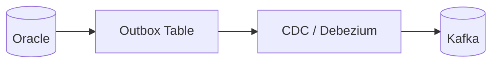

Instead of a relay process repeatedly querying the outbox table for new rows, a CDC connector (Debezium, using Oracle's redo log / LogMiner or a similar mechanism) reads database change events directly from the transaction log and streams inserted outbox rows to Kafka. Debezium specifically has a well-known **Outbox Event Router** single message transform, purpose-built for exactly this pattern — reading captured outbox table changes and routing them into topic(s) based on fields like `aggregate_type` and `event_type`.

The case for CDC over polling:

- **Reduced polling overhead** — no repeated `SELECT`/`UPDATE` claim queries hammering the table; the connector reads the transaction log instead of querying live table state.
- **Lower latency** — changes are captured near-real-time as they're committed, rather than waiting for the next poll cycle.
- **No claim/lock contention** — there's no `FOR UPDATE SKIP LOCKED` competition between relay instances, because there's fundamentally one log stream, not multiple competing pollers.

The case for being honest about what it doesn't solve:

- **Operational complexity** — running and monitoring a Debezium/Kafka Connect deployment, with its own failure modes (connector restarts, snapshot/offset management, schema registry integration), is a genuinely new operational surface, not a free upgrade.
- **Oracle-specific considerations** — Oracle CDC via LogMiner or equivalent has its own resource overhead on the database, licensing considerations for some approaches, and configuration nuances that need dedicated expertise.
- **Schema evolution** — changes to the outbox table's structure need to be coordinated with the CDC connector's configuration and any downstream consumers' expectations.
- **Failure recovery and monitoring still needed** — a stuck or lagging CDC connector is a different failure mode from a stuck relay, but it's not a *smaller* one, and it needs its own observability.

CDC doesn't eliminate at-least-once delivery semantics either — connector restarts and offset management can still produce redelivery, so the downstream idempotent-consumer design from earlier is just as necessary with CDC as with polling.

### Polling vs. CDC

| Feature | Polling Relay | CDC (Debezium) |
|---|---|---|
| Implementation complexity | Lower — plain SQL and application code | Higher — Kafka Connect, connector config, log-mining setup |
| DB query load | Ongoing SELECT/UPDATE claim traffic | Minimal — reads transaction log, not live table |
| Latency | Bound by poll interval | Near real-time, log-driven |
| Operational complexity | Moderate — manage relay instance fleet | Higher — manage connector, offsets, schema registry |
| Scaling | Add relay instances, tune partitions | Connector-level parallelism; different tuning model |
| Failure recovery | Stale-claim recovery job | Connector offset/checkpoint recovery |
| Monitoring | Outbox row-status metrics | Connector lag and health metrics, plus outbox metrics |
| Kafka integration | Direct producer calls from relay | Native Kafka Connect sink |
| Payment use case | Simpler to reason about and debug initially | Attractive once polling overhead or latency become real constraints |

Many teams start with polling for its operational simplicity and predictability, and migrate to CDC once the polling relay fleet itself becomes a scaling and latency bottleneck — not because CDC is unconditionally superior.

---

## Why Not Two-Phase Commit?

It's worth directly addressing the "why not just use 2PC across Oracle and Kafka" question, because it comes up in almost every design review.

Distributed two-phase commit across a database and a message broker requires both systems to participate as full transactional resources in a distributed transaction coordinator (XA-style). Kafka does not offer this kind of participation in the general case, and even where similar mechanisms exist in other messaging systems, 2PC brings real costs: a transaction coordinator becomes a new single point of failure and a new latency-adding hop on every request; the **blocking problem** inherent to 2PC (participants can be left holding locks indefinitely if the coordinator crashes mid-protocol) is a serious operational liability under high load; and throughput suffers because every transaction now pays the cost of coordinator round-trips across two heterogeneous systems.

| | 2PC | Transactional Outbox | Kafka Transactions |
|---|---|---|---|
| Atomicity scope | Across DB and broker | Within DB only (broker updated asynchronously) | Within Kafka only (across topics/partitions) |
| Coordinator required | Yes (external) | No | Kafka's internal transaction coordinator |
| Failure mode | Blocking, held locks across systems | At-least-once delivery, handled by idempotent consumer | Doesn't span the database at all |
| Throughput cost | High | Low | Moderate, but irrelevant to the DB-Kafka boundary |

The important nuance on the third column: **Kafka transactions make writes across multiple Kafka topics/partitions atomic — they do not make an Oracle write and a Kafka write atomic with each other.** Kafka transactions are a tool for exactly-once *stream processing* pipelines (read-process-write patterns entirely within Kafka), not a solution to the "database plus external broker" atomicity problem this article is about. The transactional outbox pattern sidesteps the entire 2PC problem by never attempting cross-system atomicity in the first place — it achieves atomicity locally (within Oracle), and accepts (and correctly handles) asynchronous, at-least-once propagation to Kafka.

---

## Exactly-Once vs. At-Least-Once: Clearing Up the Confusion

Two distinct concepts get conflated constantly in these discussions:

**Exactly-once message delivery** — a claim about how many times a message physically arrives at a consumer. Kafka's idempotent producer and transactional APIs provide strong guarantees *within Kafka's own boundaries* (producer-to-broker deduplication, atomic multi-partition writes), but as established, they don't extend across a broker-external system like Oracle or a bank API.

**Exactly-once business effect** — a claim about how many times an *action* (like a debit) actually happens, regardless of how many times a message describing it was delivered. This is the guarantee payment systems actually need, and it's achieved not by any single messaging-layer trick but through **idempotency and state management**: idempotency keys at the API layer, an idempotent-consumer pattern with a processed-event ledger at the business-processing layer, and careful state-machine design (the `UNKNOWN`/reconciliation path) for genuinely ambiguous outcomes like network timeouts to the bank.

The architecture in this article deliberately accepts at-least-once message delivery throughout (outbox-to-Kafka, Kafka-to-consumer) and achieves exactly-once business effect entirely through idempotency, not through trying to force exactly-once delivery semantics onto a system that spans more components than any single messaging protocol can atomically cover.

---

## Putting It All Together: The System at 1M TPS

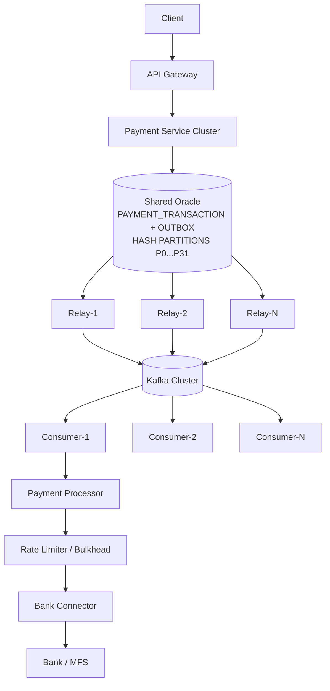

Reading it end to end: the **API Gateway and Payment Service Cluster** absorb the full 1M TPS of inbound requests, doing nothing more than validating and durably committing to Oracle — the only synchronous work on the critical path. The **shared, hash-partitioned Oracle database** distributes that write load across 32 partitions, avoiding the single-segment contention that would otherwise cap throughput far below target. A **fleet of relay instances**, coordinated implicitly through `FOR UPDATE SKIP LOCKED` row claiming, drains the outbox into the **Kafka cluster** without ever holding a database lock during network I/O. A **fleet of idempotent consumers** processes events off Kafka, each protected by a **rate limiter and circuit breaker** in front of the **bank connector**, so that the one component in this entire diagram that cannot be scaled by adding more of your own infrastructure — the bank itself — is never asked to absorb more than it can sustain, and the rest of the pipeline degrades gracefully (via queuing and lag, not data loss or duplication) when it can't.

---

## The Critical Limitation

It needs to be said plainly, because it's the part most architecture presentations skip: **partitioning the outbox table does not mean Oracle can automatically handle 1M inserts/sec.** Partitioning is a *logical scalability* technique — it improves how work is distributed and how manageable the data is. It does not change your *physical capacity* — the actual CPU cores, memory, IOPS, redo log throughput, undo tablespace capacity, network bandwidth, and connection-pool ceiling of the hardware Oracle is running on.

A database instance that can sustain 50,000 writes/sec on unpartitioned hardware might, with well-designed hash partitioning and local indexes, sustain 150,000–200,000 writes/sec on the *same* hardware — a real and meaningful improvement — but it will not sustain 1,000,000 writes/sec just because you added `PARTITIONS 32` to the DDL. If you need genuinely more throughput than your current hardware's physical ceiling allows, your options are: scale the hardware up (more CPU, faster storage, more memory for buffer cache — vertical scaling, which has its own ceiling and cost curve), scale out with something like Oracle RAC (multiple instances sharing the same underlying storage, extending capacity while keeping a single logical database), or scale out with **database sharding** (genuinely separate database instances, each owning a disjoint subset of the data) — a materially larger architectural and operational commitment, covered next.

---

## When Shared Oracle Is No Longer Enough

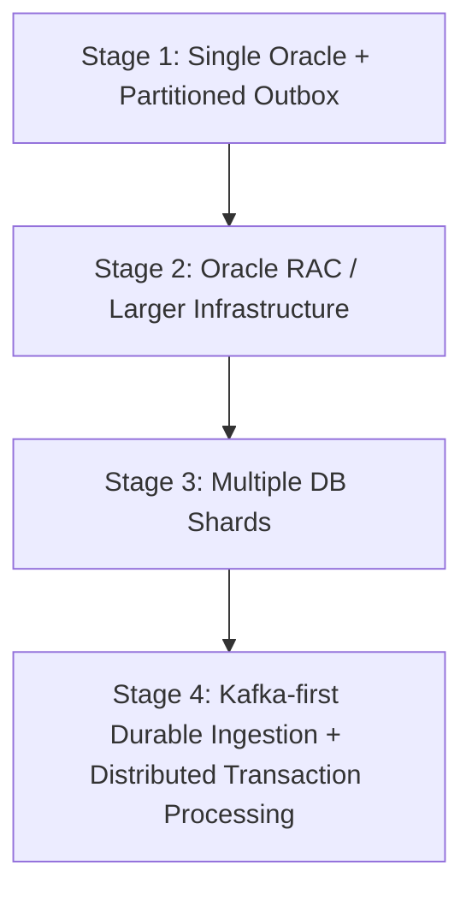

This is presented as a set of stages, not a mandatory universal progression — plenty of real systems operate happily and durably at Stage 1 or Stage 2 forever, because their actual sustained (not theoretical peak) throughput never demands more.

**Stage 1 — Single Oracle, partitioned outbox.** Everything covered in this article. Appropriate for a very wide range of real payment workloads; the ceiling here is higher than most teams assume before they've actually tuned it.

**Stage 2 — Oracle RAC or substantially larger single-database infrastructure.** Extends capacity by adding compute nodes sharing the same storage, without fragmenting your data model or forcing the application to become shard-aware. The trade-off is cost and RAC-specific operational expertise (interconnect tuning, cache fusion behavior, etc.).

**Stage 3 — Multiple database shards.** Necessary when a single database's realistic hardware and RAC-extended ceiling genuinely can't be pushed further, and when your data model has a natural, stable sharding key (e.g., customer ID range, merchant ID) that doesn't require frequent cross-shard transactions. The cost here is real: your application (or a routing layer) now needs shard awareness, cross-shard queries and reporting become materially harder, and rebalancing shards as data grows is an ongoing operational burden.

**Stage 4 — Kafka-first durable ingestion with distributed transaction processing.** For the small set of systems that genuinely operate beyond what sharded relational databases comfortably support, some architectures move the durability guarantee earlier in the pipeline — treating Kafka itself (with appropriate replication and durability settings) as the initial durable ingestion point, with distributed processing frameworks handling downstream transaction logic. This is a substantially different architecture with its own considerable complexity and is appropriate for a narrow set of extreme-scale systems, not a general recommendation.

The trade-off that should drive this decision at every stage is the same one: does the *actual measured* throughput and latency requirement justify the *actual operational cost* of the next stage? Reaching for Stage 3 or 4 before Stage 1 and 2 have been genuinely exhausted and benchmarked is one of the most common and expensive architecture mistakes in this space.

---

## 10 Things I Would Never Do in a High-Scale Payment Outbox

1. **Call the bank synchronously from the API.** Couples request acceptance latency to the slowest downstream dependency and caps your throughput at the bank's capacity, on the critical request path no less.
2. **Hold database locks while calling Kafka.** Turns a bounded database operation into one governed by network I/O duration, collapsing throughput under load.
3. **Poll one row at a time.** Pays per-round-trip overhead on every single event; batch claiming exists specifically to amortize that cost.
4. **Use one relay instance.** A single process has a hard throughput ceiling regardless of how well-written it is; horizontal relay scaling is what actually gets you to high aggregate throughput.
5. **Assume Kafka means exactly once.** Kafka's idempotent producer and transactions guarantee exactly-once *within Kafka's boundary*, not across your database, relay, and bank integration.
6. **Ignore idempotency.** Without an idempotency key at the API layer and a processed-event table at the consumer layer, at-least-once delivery becomes duplicate business effects — including duplicate debits.
7. **Keep billions of published rows forever.** Un-archived growth degrades query performance, backup times, and storage cost indefinitely; partition-based retention exists to prevent exactly this.
8. **Add indexes blindly.** Every index is write amplification on a table already taking extreme write volume; index only what your actual query patterns require.
9. **Retry a bank debit blindly after a timeout.** A timeout means "unknown outcome," not "definitely failed" — blind retry risks a genuine duplicate debit at the one place it's hardest to reverse.
10. **Assume partitioning alone solves database scalability.** Partitioning improves distribution and manageability within your existing hardware's capacity; it does not add CPU, IOPS, or network bandwidth your hardware doesn't have.

---

## Interview-Level Questions

**1. Why do we need the Outbox pattern?**
Because a database transaction and a Kafka publish are two independent systems with no shared atomicity guarantee. The outbox pattern achieves atomicity by writing the event as a row in the same local database transaction as the business data, then relaying it to Kafka asynchronously.

**2. Why not directly publish to Kafka from the request handler?**
Because if the process crashes between the DB commit and the Kafka publish (or vice versa), you get a lost event or a phantom event with no way to recover deterministically. The outbox table makes the event durable and recoverable independent of the Kafka call's success or timing.

**3. Why use `FOR UPDATE SKIP LOCKED`?**
It lets multiple relay workers concurrently claim disjoint batches of rows from a shared queue without blocking on each other — a locked row is simply skipped by other workers rather than causing them to wait.

**4. Why not hold the lock while publishing to Kafka?**
Because lock duration would then depend on network latency to an external system, causing long-held locks, connection pool exhaustion, and collapsing throughput under load. Claim and commit first; publish afterward, outside any open transaction.

**5. What happens if a relay crashes mid-batch?**
Rows it claimed stay in `PROCESSING` with no certainty about which were actually published. A recovery job resets rows whose claim has exceeded a lease timeout back to `NEW`, so another relay can pick them up.

**6. Can the outbox produce duplicate Kafka events?**
Yes — this is inherent to the design (at-least-once delivery), specifically because of the crash-recovery mechanism above. It's an accepted trade-off, not a defect.

**7. How do you prevent duplicate payment processing?**
Two layers: an idempotency key with a unique constraint at the API layer prevents duplicate payment creation from client retries; a processed-event table at the consumer layer prevents duplicate business effects from duplicate Kafka deliveries.

**8. How do you scale the outbox?**
Hash-partition the table for write distribution, use local indexes, run multiple relay instances claiming via `SKIP LOCKED`, tune batch sizes and poll intervals, and archive/retire old rows via partition-based retention — all before considering database sharding.

**9. How does hash partitioning work here?**
Oracle applies a hash function to the partitioning key (e.g., `transaction_id`) and routes each row to one of N partitions based on the result, distributing writes and enabling parallel, independent access across partitions.

**10. Why use time-based partitioning as well?**
Hash partitioning alone doesn't group rows by age, which you need for efficient bulk retention/archival. Composite (range-by-time, sub-partitioned by hash) partitioning gives you both write distribution and cheap partition-drop-based cleanup.

**11. Polling vs. CDC — how do you choose?**
Polling is operationally simpler and a reasonable starting point; CDC (e.g., Debezium's Outbox Event Router) removes claim-query overhead and reduces latency but adds real operational complexity (connector management, log-mining overhead, schema evolution handling). Choose CDC once polling's overhead or latency genuinely becomes the bottleneck, not by default.

**12. Why is 1M TPS hard for a single Oracle instance?**
Because it's bound by physical hardware capacity — CPU, IOPS, redo log throughput, memory, network — not just logical schema design. Partitioning improves distribution within that capacity; it doesn't increase the capacity itself.

**13. What's usually the actual bottleneck in this architecture?**
Very often the downstream bank/MFS system, which typically has far less throughput capacity than your own infrastructure — Kafka is a buffer that absorbs bursts, not a multiplier of the bank's real capacity.

**14. What happens if Kafka is down?**
The relay's publish attempts fail; claimed rows remain in `PROCESSING`; stale-claim recovery eventually resets them to `NEW`, and they get republished once Kafka is healthy again. No data is lost, though there may be a processing delay.

**15. What happens if the bank is down?**
The consumer's circuit breaker should trip, failing fast rather than tying up consumer capacity in timeouts; affected transactions can be retried via the retry topic with backoff, or, if the outage is prolonged, held and monitored rather than blindly hammered.

**16. What is at-least-once delivery, precisely?**
A guarantee that a message will be delivered one or more times, but never zero times — the opposite failure mode from at-most-once (which risks silent loss). It requires idempotent handling downstream to be safe for business-critical actions.

**17. Exactly-once delivery vs. idempotency — how do they relate?**
Exactly-once delivery is a messaging-layer guarantee that's very hard to achieve end-to-end across heterogeneous systems (DB, broker, external bank). Idempotency achieves the practically important outcome — exactly-once *business effect* — even when delivery is only guaranteed at-least-once.

**18. How do you recover stale `PROCESSING` records?**
A scheduled job resets rows whose `claimed_at` exceeds a lease timeout (derived from observed claim-to-publish latency) back to `NEW`, so they can be reclaimed and reprocessed by any available relay.

**19. How do you clean up billions of outbox records?**
Partition-based retention: rows are organized by time via range (or composite range/hash) partitioning, and entire partitions are archived and dropped once outside the retention window — far cheaper than row-by-row deletes.

**20. When would you shard the database?**
When a single Oracle instance's realistic hardware capacity — even after partitioning, indexing, and potentially RAC — genuinely cannot sustain the required sustained throughput, and you have a stable, natural sharding key that doesn't require frequent cross-shard transactions. Sharding should be a last resort given its operational cost, not a default starting architecture.

---

## Conclusion

Scaling a payment system from 10,000 TPS to 1,000,000 TPS is rarely about finding one clever trick. It's about methodically removing coupling — decoupling request acceptance from bank processing, decoupling the database transaction from the Kafka publish, decoupling relay claiming from Kafka network I/O — and then, at every layer, being honest about what the resulting guarantee actually is. The Transactional Outbox pattern doesn't give you exactly-once delivery; it gives you *reliable, atomic local persistence* plus *at-least-once propagation*, and it's your idempotent consumer design and state machine that convert that into the exactly-once business effect a payment system actually needs.

Partitioning, row claiming, relay clustering, and CDC are all techniques for getting more throughput out of a shared database before you take on the real operational cost of sharding. And no matter how well any of this is tuned, the downstream bank's real capacity remains the ceiling that asynchronous architecture makes survivable, not the ceiling it removes.

If there's one sentence to take away: **the hard part of high-throughput payments was never making things fast — it was making failure, duplication, and ambiguity safe.**

---

## References / Further Reading

- Apache Kafka documentation — producer configuration, idempotence, and transactions: https://kafka.apache.org/documentation/
- Oracle Database documentation — table partitioning and `FOR UPDATE SKIP LOCKED`: https://docs.oracle.com/en/database/
- Debezium documentation — Outbox Event Router: https://debezium.io/documentation/reference/stable/transformations/outbox-event-router.html
- Microservices.io — Transactional Outbox pattern: https://microservices.io/patterns/data/transactional-outbox.html
